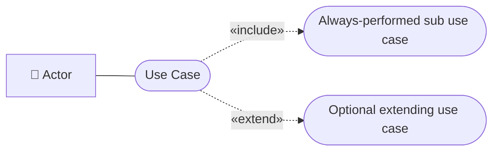
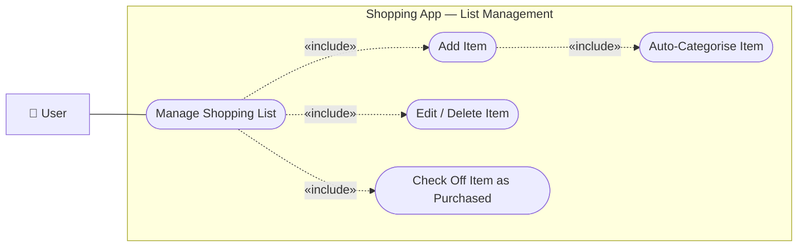
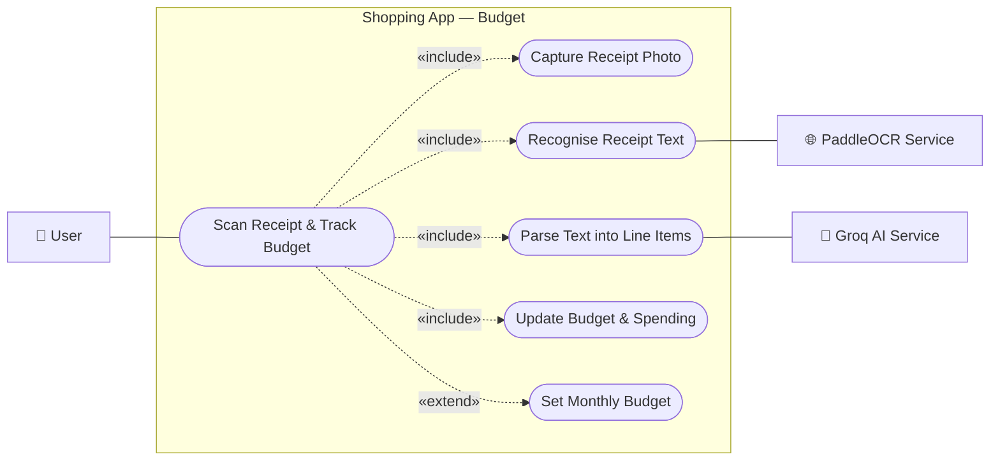
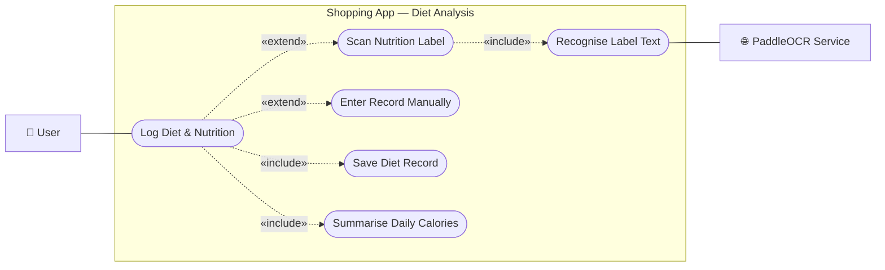
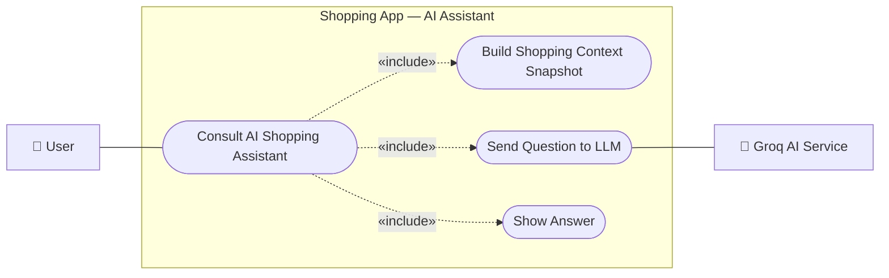
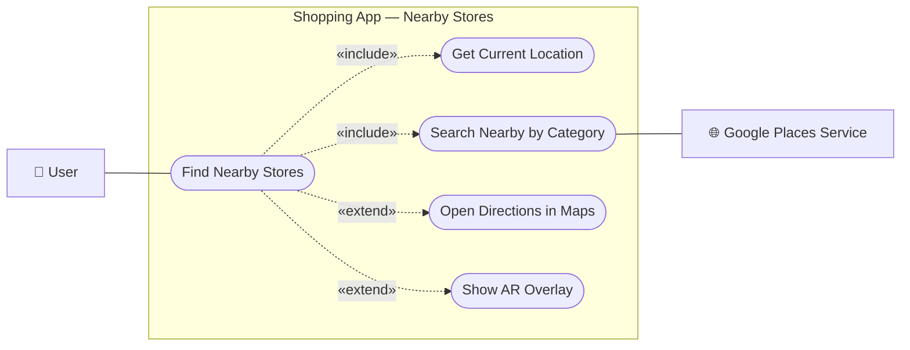
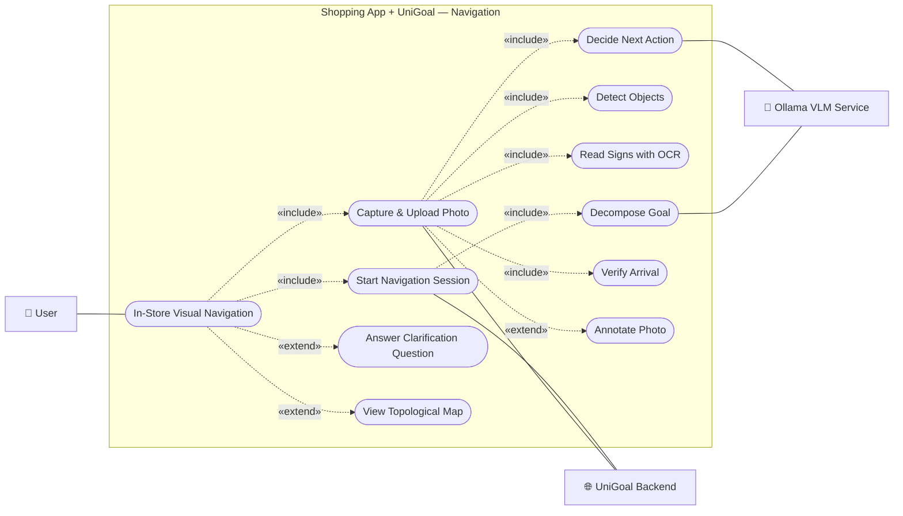
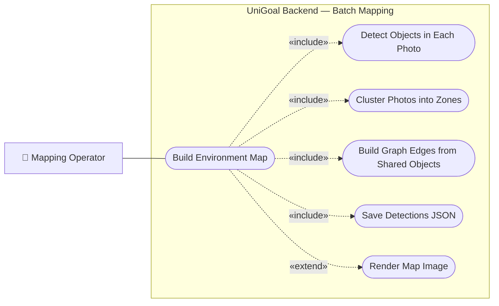
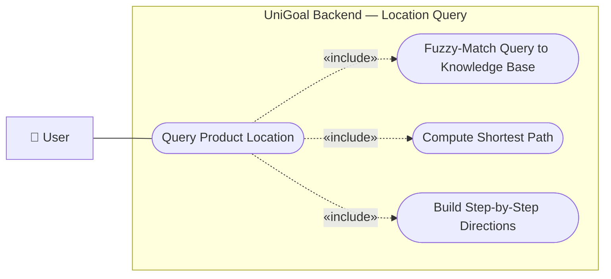

# Chapter 5 — Use Case Diagrams

The information system provides **eight functions**. Each is presented below as
its own use case diagram. A labelled box is the **system boundary**, rounded
shapes are **use cases**, and lines connect **actors** to the use cases they
take part in. Dashed arrows carry the `«include»` and `«extend»` stereotypes.

**Legend**

---

## Function 1 — Manage Shopping List

The user builds and maintains a shopping list: add, edit, delete, and check off
items. Items are auto-categorised, and checking an item feeds the budget.

---

## Function 2 — Scan Receipt & Track Budget

The user photographs a receipt; the app reads it with cloud OCR, asks the LLM to
parse it into line items, adds them to the budget, and shows spending vs. the
monthly budget by category.

---

## Function 3 — Log Diet & Nutrition

The user scans a food/nutrition label (or enters data manually); the app reads
the values, stores a diet record, and totals calories and macros for the day.

---

## Function 4 — Consult AI Shopping Assistant

The user chats with the assistant. Each question is sent to the LLM together
with a snapshot of the shopping context (inventory + budget + health), so the AI
can answer cross-module questions.

---

## Function 5 — Find Nearby Stores

The user opens the nearby-stores view; the app reads GPS, queries the maps
service for nearby shops of a chosen category, lists them, and can open
directions or an AR overlay.

---

## Function 6 — In-Store Visual Navigation

The core integration. The user states a goal, then walks and uploads photos; the
backend detects objects, reads signs, asks the VLM for the next action, gates
any arrival claim, and replies `MOVE` / `ASK` / `ARRIVED`. The user can answer
questions and view the map.

---

## Function 7 — Build Environment Map (offline)

A mapping operator points the batch mapper at a folder of survey photos; the
system detects objects in every photo, clusters them into zones, builds the
graph, and renders a topological map image.

---

## Function 8 — Query Product Location on Map

On a pre-built map, the user (or operator) asks where a product, room, or
professor's office is. The system fuzzy-matches the query against the knowledge
base and returns step-by-step directions via shortest path.

