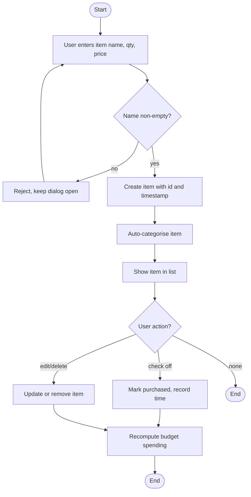
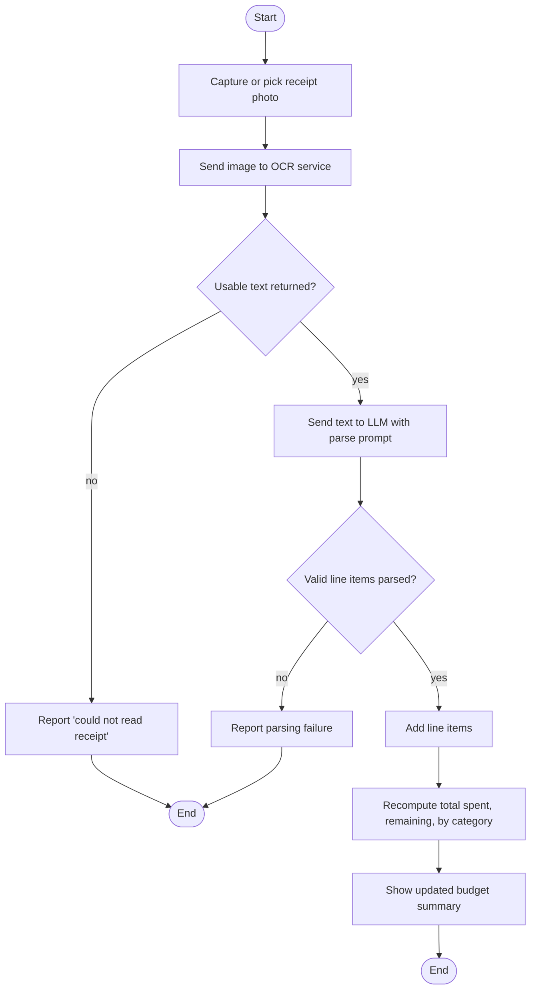
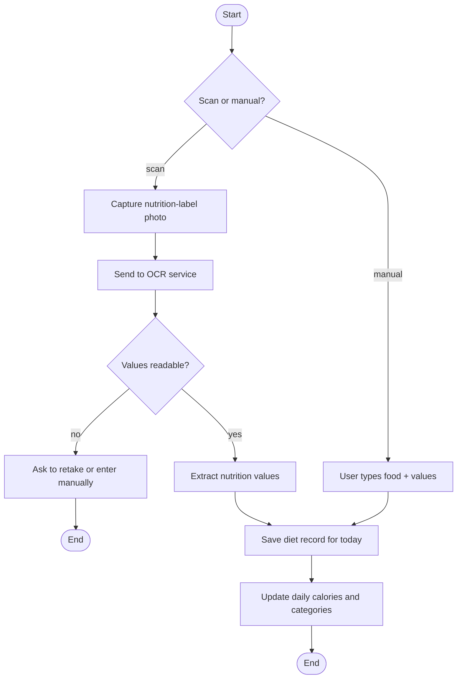
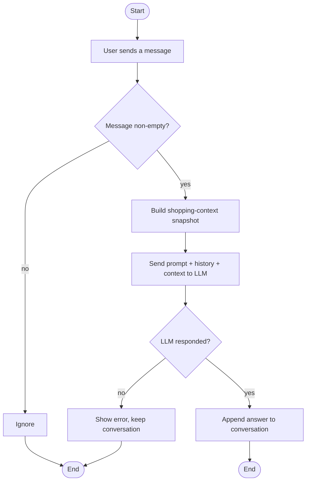
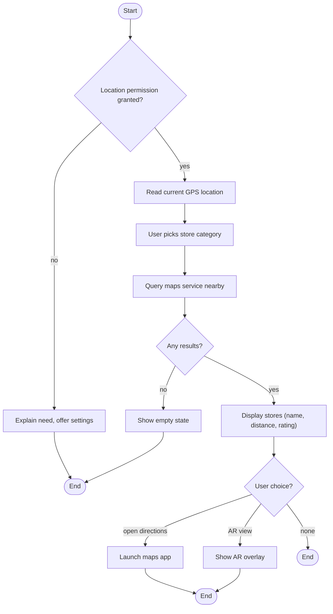
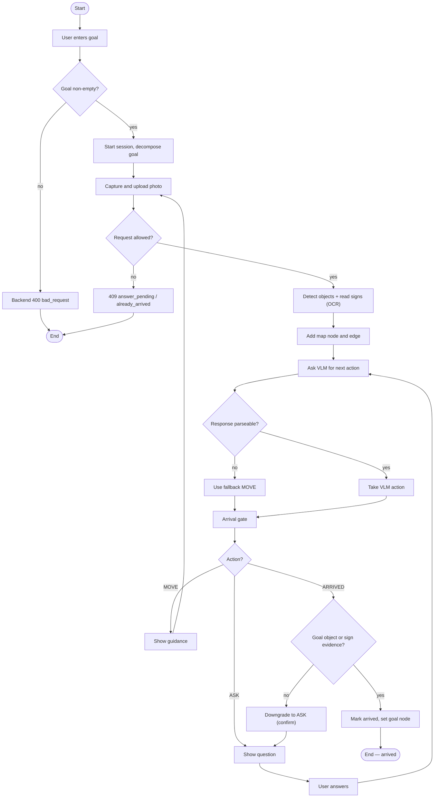
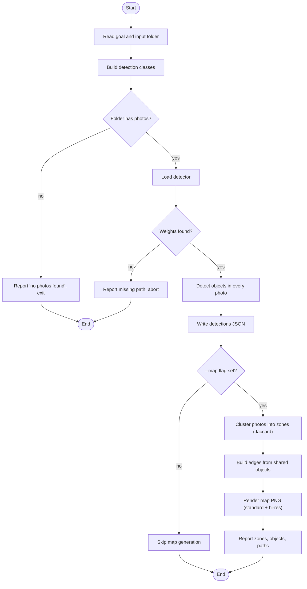
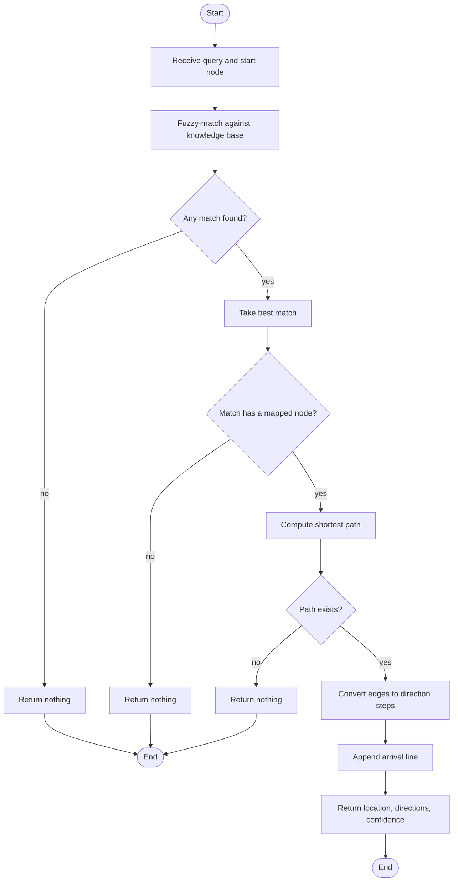

# Chapter 7 — Activity Diagrams

For each use case diagram (and its descriptions), this chapter gives one
complete activity diagram. Read top-to-bottom: a start node, rectangular
actions, diamond decisions with guard conditions, and end nodes. The exception
scenarios from Chapter 6 appear as branches off the decisions.

---

## Function 1 — Manage Shopping List

---

## Function 2 — Scan Receipt & Track Budget

---

## Function 3 — Log Diet & Nutrition

---

## Function 4 — Consult AI Shopping Assistant

---

## Function 5 — Find Nearby Stores

---

## Function 6 — In-Store Visual Navigation

---

## Function 7 — Build Environment Map (offline)

---

## Function 8 — Query Product Location on Map

