# Chapter 8 — Class Diagram

One class diagram for the whole information system. It is organised into two
namespaces — the **Android client** and the **UniGoal navigation backend** —
joined by the `NavigatorApi → NavigationServer` HTTP boundary. Each class shows
its key attributes and operations; associations and dependencies are drawn
below the class declarations.

- `«service»` marks a stateless module of functions (some units are Kotlin
  top-level helpers or Python modules rather than instantiated classes; they are
  shown as service classes so their operations and dependencies are visible).
- `«enumeration»` marks an enum. `«screen»` marks a Jetpack Compose screen.

```mermaid
classDiagram
    direction TB

    namespace AndroidClient {
        class MainContainer {
            <<controller>>
            +List~ShoppingItem~ shoppingItems
            +List~DietRecord~ dietRecords
            +int budgetTotal
            +scanReceipt(bitmap) void
            +reclassifyAll() void
            +selectTab(index) void
        }
        class ShoppingItem {
            +String id
            +String name
            +int qty
            +int price
            +bool isChecked
            +String storeName
            +String location
        }
        class ShoppingList {
            +String id
            +String date
            +List~ShoppingItem~ items
            +String status
        }
        class DietRecord {
            +String id
            +String date
            +String name
            +int totalCalories
            +double carbs
            +double protein
            +double fat
            +String foodCategory
        }
        class UserProfile {
            +String name
            +String gender
            +String allergies
            +String disease
            +String activityLevel
        }
        class ShoppingContext {
            +InventorySnapshot inventory
            +BudgetSnapshot budget
            +HealthSnapshot health
            +ContextSummary summary
            +toJsonString() String
        }
        class InventorySnapshot {
            +List~ItemEntry~ pending_items
            +List~ItemEntry~ purchased_items
        }
        class BudgetSnapshot {
            +int monthly_budget
            +int total_spent
            +int remaining
            +Map spending_by_category
        }
        class HealthSnapshot {
            +int total_calories_today
            +List~DietEntry~ diet_records_today
        }
        class NavigatorApi {
            <<service>>
            +String BASE_URL
            +startSession(goal) SessionStart
            +uploadPhoto(id, jpeg) Turn
            +answer(id, answer) Turn
        }
        class SessionStart {
            +String sessionId
            +String guidance
            +List~String~ goalObjects
        }
        class Turn {
            +String action
            +String guidance
            +String question
            +int nodeId
            +String annotatedPhotoUrl
        }
        class GroqApiService {
            <<service>>
            +getCompletion(key, request) GroqResponse
        }
        class GeminiBudgetResponse {
            +List~GeminiLineItem~ line_items
        }
        class CategoryClassifier {
            <<service>>
            +normalizeCategory(name) String
            +reclassifyAll(items) List~ShoppingItem~
        }
        class NavigationScreen {
            <<screen>>
            +capturePhoto() void
            +render() void
        }
        class NearbyStoresSheet {
            <<screen>>
            +searchNearby(category) void
        }
        class AIScreen {
            <<screen>>
            +sendMessage(text) void
        }
    }

    namespace NavigationBackend {
        class NavigationServer {
            <<service>>
            +start_session(req) StartSessionResponse
            +upload_photo(id, photo) TurnResponse
            +post_answer(id, req) TurnResponse
            +get_map(id, format) MapJSON
        }
        class SessionStore {
            -dict _sessions
            +create(goal, objects) Session
            +get(id) Session
        }
        class Session {
            +String id
            +String goal
            +List~String~ goal_objects
            +TopoMap topomap
            +bool arrived
            +int goal_node
            +String pending_question
        }
        class TopoMap {
            -DiGraph graph
            +add_node(path, detected, summary, ocr) int
            +add_edge(from, to, action) void
            +to_dict(current, goal) dict
            +summarize_for_vlm(id) String
            +render_png(id) bytes
        }
        class Perception {
            +String device
            +load() void
            +detect(path, classes) List~Detection~
        }
        class Detection {
            +String label
            +List~float~ box
            +float score
        }
        class OCR {
            -List~String~ _languages
            +load() void
            +read(path, minConf, max) List~OCRResult~
        }
        class OCRResult {
            +String text
            +float confidence
            +List bbox
        }
        class VLMClient {
            <<service>>
            +decide(image, goal, summaries) VLMResponse
            +warm_up() void
        }
        class VLMResponse {
            +VLMAction action
            +String guidance
            +String question
            +String vlm_summary
        }
        class VLMAction {
            <<enumeration>>
            ARRIVED
            MOVE
            ASK
        }
        class GoalDecomposer {
            <<service>>
            +decompose_goal(goal) List~String~
        }
        class SceneFormatter {
            <<service>>
            +format_detections(dets, w, h) String
            +match_ocr_to_goal(results, objects) List~String~
            +verify_arrival(resp, dets, ocr, objects) VLMResponse
        }
        class Navigator {
            <<service>>
            +navigate_to_product(query, start) dict
        }
        class StoreKnowledge {
            <<service>>
            +find_product(query) List~LocationMatch~
        }
        class RoomInfo {
            +int node_id
            +String name_zh
            +String name_en
            +List~String~ landmarks_en
        }
        class LocationMatch {
            +String display_en
            +int aisle_number
            +String matched_keyword
            +float confidence
        }
        class BatchMapper {
            <<service>>
            +build_detect_classes(goal) List~String~
            +run(input, goal, map) void
        }
    }

    %% ---- Android client relationships ----
    MainContainer "1" o-- "*" ShoppingItem : holds
    MainContainer "1" o-- "*" DietRecord : holds
    MainContainer ..> ShoppingContext : builds
    MainContainer ..> NavigatorApi : uses
    MainContainer ..> GroqApiService : uses
    MainContainer ..> CategoryClassifier : uses
    ShoppingList "1" o-- "*" ShoppingItem : contains
    ShoppingContext *-- InventorySnapshot
    ShoppingContext *-- BudgetSnapshot
    ShoppingContext *-- HealthSnapshot
    GroqApiService ..> GeminiBudgetResponse : returns
    AIScreen ..> GroqApiService : calls
    AIScreen ..> ShoppingContext : sends
    NavigationScreen ..> NavigatorApi : calls
    NavigatorApi ..> SessionStart : returns
    NavigatorApi ..> Turn : returns
    NearbyStoresSheet ..> MainContainer : reads list

    %% ---- Cross-boundary integration ----
    NavigatorApi ..> NavigationServer : HTTP REST

    %% ---- Backend relationships ----
    NavigationServer --> SessionStore : uses
    NavigationServer --> Perception : uses
    NavigationServer --> OCR : uses
    NavigationServer ..> VLMClient : calls
    NavigationServer ..> GoalDecomposer : calls
    NavigationServer ..> SceneFormatter : calls
    SessionStore "1" o-- "*" Session : manages
    Session "1" *-- "1" TopoMap : owns
    Perception ..> Detection : produces
    OCR ..> OCRResult : produces
    VLMClient ..> VLMResponse : returns
    VLMResponse --> VLMAction : has
    SceneFormatter ..> VLMResponse : may rewrite
    Navigator ..> StoreKnowledge : queries
    Navigator ..> TopoMap : path-finds on
    StoreKnowledge "1" *-- "*" RoomInfo : holds
    StoreKnowledge ..> LocationMatch : produces
    BatchMapper ..> Perception : reuses
    BatchMapper ..> TopoMap : builds
```

## Notes on the design

- **Two cooperating subsystems.** The Android client owns all user-facing state
  and the shopping domain (`ShoppingItem`, `DietRecord`, `ShoppingContext`); the
  Python backend owns the navigation domain (`Session`, `TopoMap`, perception).
  They meet at exactly one seam: `NavigatorApi` (client) calls
  `NavigationServer` (backend) over REST. This keeps the heavy vision models off
  the phone.

- **Context Provider pattern.** `ShoppingContext` aggregates the three app
  modules (list, budget, health) into one snapshot so the AI assistant can
  answer cross-module questions without coupling the modules to each other.

- **Evidence vs. decision (backend).** `Perception` and `OCR` only produce
  evidence (`Detection`, `OCRResult`); `VLMClient` makes the decision; and
  `SceneFormatter.verify_arrival` independently re-checks it (the arrival gate),
  possibly rewriting a `VLMResponse`.

- **One map structure, two builders.** The same `TopoMap` is built live during
  navigation (`Session.topomap`) and offline in bulk (`BatchMapper`);
  `Navigator` runs shortest-path queries over a pre-built map.

- **Bilingual throughout.** `RoomInfo`/`LocationMatch` (backend) and the diet /
  item models (app) carry both English and Chinese text so the system works in
  either language.
