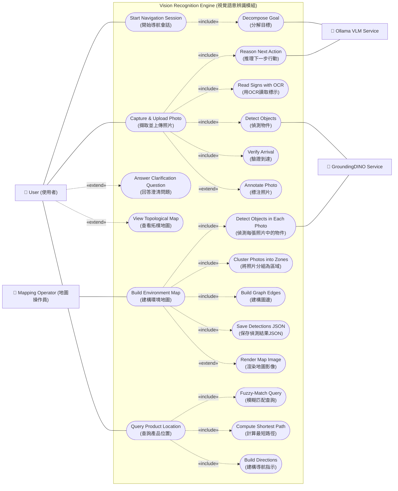
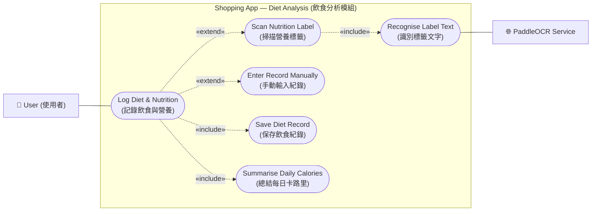

# 視覺語意辨識模組 & 飲食分析模組 — 使用案例圖與描述
# Vision Recognition Engine & Diet Analysis Module — Use Case Diagrams and Descriptions

---

## 目錄 (Table of Contents)

1. [模組 1：視覺語意辨識模組 (Vision Recognition Engine)](#模組-1視覺語意辨識模組-vision-recognition-engine)
   - [角色 (Actors)](#角色-actors)
   - [使用案例圖 (Use Case Diagram)](#使用案例圖-use-case-diagram)
   - [使用案例描述 (Use Case Descriptions)](#使用案例描述-use-case-descriptions)

2. [模組 2：飲食分析模組 (Diet Analysis Module)](#模組-2飲食分析模組-diet-analysis-module)
   - [角色 (Actors)](#角色-actors-1)
   - [使用案例圖 (Use Case Diagram)](#使用案例圖-use-case-diagram-1)
   - [使用案例描述 (Use Case Descriptions)](#使用案例描述-use-case-descriptions-1)

---

# 模組 1：視覺語意辨識模組 (Vision Recognition Engine)

## 系統概述 (System Overview)

視覺語意辨識模組負責將手機捕捉到的「視覺特徵」轉化為「空間位置」。核心功能包括：

- **GroundingDINO物件偵測**：偵測畫面中的重要物件與環境特徵（門口、走道、標示物等）
- **SAM影像分割與標注**：對偵測到的物件進行分割與標注
- **多模態語意推論**：利用 Ollama VLM 進行場景分析與導航決策
- **拓樸節點建立**：每次影像分析後建立節點，記錄觀察結果
- **邊與移動關係維護**：追蹤使用者移動路徑，逐步形成拓樸地圖

**The Vision Recognition Engine converts visual features captured by the phone into spatial locations. Key functions include:**

- **GroundingDINO Object Detection**: Detects important objects and environmental features in the scene (doors, aisles, signs, etc.)
- **SAM Image Segmentation & Annotation**: Segments and annotates detected objects
- **Multimodal Semantic Reasoning**: Uses Ollama VLM for scene analysis and navigation decisions
- **Topological Node Creation**: Creates nodes after each image analysis to record observations
- **Edge & Movement Relationship Maintenance**: Tracks user movement paths and gradually builds topological maps

---

## 角色 (Actors)

| 角色英文名 | 角色中文名 | 描述 (Description) | 描述 (中文) |
|-----------|-----------|---|---|
| User | 使用者 | The shopper performing in-store navigation and seeking directions to products | 進行店內導航的購物者，尋求產品位置指示 |
| Mapping Operator | 地圖操作員 | Technician responsible for building and maintaining offline store topology maps | 負責建立和維護離線商店拓樸地圖的技術人員 |
| GroundingDINO | GroundingDINO物件偵測服務 | Backend service that detects objects, landmarks, and text regions in images | 偵測影像中物件、地標和文字區域的後端服務 |
| SAM | SAM影像分割服務 | Backend service that segments and annotates detected object regions | 對偵測到的物件區域進行分割和標注的後端服務 |
| Ollama VLM | Ollama視覺語言模型 | Backend vision-language model that reasons about scenes and generates navigation decisions | 對場景進行推理並生成導航決策的後端視覺語言模型 |

---

## 使用案例圖 (Use Case Diagram)

### Mermaid 圖示 (Mermaid Diagram)

### 使用案例概覽 (Use Case Overview)

| # | 使用案例 (Use Case) | 主要角色 (Primary Actor) | 描述 (Description) |
|---|------------------|--------|-----------|
| 1 | Start Navigation Session (開始導航會話) | User (使用者) | User states a product goal; system decomposes it into landmarks with the VLM's help |
| 2 | Capture & Upload Photo (擷取並上傳照片) | User (使用者) | User captures a photo; system detects objects, reads text, reasons about next action |
| 3 | Answer Clarification Question (回答澄清問題) | User (使用者) | System asks clarification; user answers; VLM re-reasons about the location |
| 4 | View Topological Map (查看拓樸地圖) | User (使用者) | User views the topological map built from navigation history |
| 5 | Build Environment Map (建構環境地圖) | Mapping Operator (地圖操作員) | Offline batch process: detect objects in survey photos, cluster into zones, build graph |
| 6 | Query Product Location (查詢產品位置) | User (使用者) | User searches for a product; system returns step-by-step directions on the pre-built map |

---

## 使用案例描述 (Use Case Descriptions)

### 使用案例 1.0：開始導航會話 (Start Navigation Session)

#### 1.0 正常情節 (Normal Scenario)

| 欄位 (Field) | 內容 (English) | 內容 (中文) |
|-----------|-----------|-----------|
| **使用案例** | Start Navigation Session | 開始導航會話 |
| **主要角色** | User | 使用者 |
| **支持角色** | Ollama VLM Service | Ollama視覺語言模型服務 |
| **前置條件** | The app is on the navigation screen; a store map is available | 應用程式在導航螢幕上；商店地圖可用 |
| **後置條件** | A navigation session is created; the goal is decomposed into landmarks | 導航會話已建立；目標被分解為地標 |
| **觸發事件** | The user states a product goal (e.g., "Find milk in Aisle 3") | 使用者陳述產品目標（例如「在通道3中找牛奶」） |

**主要成功情節 (Main Success Scenario)**

| 步驟 | English | 中文 |
|-----|---------|------|
| 1 | The user enters a product name or aisle number | 使用者輸入產品名稱或通道號碼 |
| 2 | The system creates a navigation session and records the goal | 系統建立導航會話並記錄目標 |
| 3 | The system sends the goal + current map context to Ollama VLM | 系統將目標 + 目前地圖背景發送至 Ollama VLM |
| 4 | The VLM decomposes the goal into intermediate landmarks (e.g., "Find Aisle 3 entrance → Walk to aisle → Locate milk shelf") | VLM 將目標分解為中間地標（例如「找到通道3入口 → 走到通道 → 定位牛奶架」） |
| 5 | The system shows the decomposed plan to the user and prompts them to start capturing photos | 系統向使用者顯示分解的計劃並提示他們開始拍攝照片 |

#### 1.E1 例外情節：無效或未知的目標 (Exception: Invalid or Unknown Goal)

| 欄位 (Field) | 內容 (English) | 內容 (中文) |
|-----------|-----------|-----------|
| **觸發事件** | The user enters a product that doesn't exist in the knowledge base | 使用者輸入知識庫中不存在的產品 |

**例外情節 (Exception Scenario)**

| 步驟 | English | 中文 |
|-----|---------|------|
| 1 | At step 3, the VLM cannot find the goal in the current store's knowledge base | 在步驟3，VLM找不到目前商店知識庫中的目標 |
| 2 | The system informs the user and suggests nearby alternatives or manual search | 系統通知使用者並建議附近的替代方案或手動搜尋 |
| 3 | The navigation session is not created | 導航會話未建立 |

---

### 使用案例 2.0：擷取並上傳照片 (Capture & Upload Photo)

#### 2.0 正常情節 (Normal Scenario)

| 欄位 (Field) | 內容 (English) | 內容 (中文) |
|-----------|-----------|-----------|
| **使用案例** | Capture & Upload Photo | 擷取並上傳照片 |
| **主要角色** | User | 使用者 |
| **支持角色** | GroundingDINO Service, Ollama VLM Service | GroundingDINO服務、Ollama視覺語言模型服務 |
| **前置條件** | A navigation session is active | 導航會話處於活躍狀態 |
| **後置條件** | The system returns a MOVE / ASK / ARRIVED instruction; a new topological node is created | 系統返回 MOVE/ASK/ARRIVED 指令；建立新的拓樸節點 |
| **觸發事件** | The user captures a new photo of their surroundings | 使用者拍攝周圍環境的新照片 |

**主要成功情節 (Main Success Scenario)**

| 步驟 | English | 中文 |
|-----|---------|------|
| 1 | The user taps the camera button and captures a photo of the current location | 使用者點擊相機按鈕並拍攝目前位置的照片 |
| 2 | The system sends the image to GroundingDINO for object detection | 系統將影像發送至 GroundingDINO 進行物件偵測 |
| 3 | GroundingDINO detects key landmarks (e.g., doors, aisles, shelves, signs, plants, target objects) | GroundingDINO 偵測關鍵地標（例如門、走道、架子、標示、植物、目標物件） |
| 4 | The system extracts any visible text from the image using OCR | 系統使用 OCR 從影像中提取任何可見文字 |
| 5 | The system sends the original image + detections + OCR text + goal + history to Ollama VLM | 系統將原始影像 + 偵測結果 + OCR 文字 + 目標 + 歷史記錄發送至 Ollama VLM |
| 6 | The VLM reasons about the current scene and returns: MOVE {direction}, ASK {question}, or ARRIVED {landmark} | VLM 推理目前場景並返回：MOVE {方向}、ASK {問題} 或 ARRIVED {地標} |
| 7 | If MOVE, show direction; if ASK, show question; if ARRIVED, verify the landmark | 若為MOVE，顯示方向；若為ASK，顯示問題；若為ARRIVED，驗證地標 |
| 8 | Create a topological node with: image ID, detected objects, VLM response, user annotation, annotated image path, navigation state | 建立拓樸節點，包含：影像ID、偵測到的物件、VLM回應、使用者標注、標注影像路徑、導航狀態 |
| 9 | Update the topological map by adding an edge between the previous node and new node (representing user movement) | 通過在前一個節點和新節點之間添加邊來更新拓樸地圖（表示使用者移動） |

#### 2.E1 例外情節：模糊或無信息的照片 (Exception: Blurry or Uninformative Photo)

| 欄位 (Field) | 內容 (English) | 內容 (中文) |
|-----------|-----------|-----------|
| **觸發事件** | The photo is too blurry or contains no recognizable landmarks | 照片太模糊或不包含可識別的地標 |

**例外情節 (Exception Scenario)**

| 步驟 | English | 中文 |
|-----|---------|------|
| 1 | At step 2, GroundingDINO detects few or no meaningful objects | 在步驟2，GroundingDINO偵測到很少或沒有有意義的物件 |
| 2 | The VLM cannot reason meaningfully about the location | VLM無法對位置進行有意義的推理 |
| 3 | The system asks the user to retake the photo with better lighting or a clearer view | 系統要求使用者重新拍攝照片，以獲得更好的照明或更清晰的視圖 |
| 4 | No node is created; the system waits for a new photo | 不建立節點；系統等待新照片 |

#### 2.E2 例外情節：VLM 返回無效或模糊的回應 (Exception: Invalid or Ambiguous VLM Response)

| 欄位 (Field) | 內容 (English) | 內容 (中文) |
|-----------|-----------|-----------|
| **觸發事件** | The VLM output cannot be parsed or is unclear | VLM 輸出無法解析或不清楚 |

**例外情節 (Exception Scenario)**

| 步驟 | English | 中文 |
|-----|---------|------|
| 1 | At step 6, the VLM returns unparseable or ambiguous output | 在步驟6，VLM返回無法解析或模糊的輸出 |
| 2 | The system logs the error and returns a generic ASK response: "I'm not sure. Can you describe what you see?" | 系統記錄錯誤並返回通用ASK回應：「我不確定。你能描述一下你看到什麼嗎？」 |
| 3 | The user provides a description; the system re-sends the description + image to the VLM | 使用者提供描述；系統將描述 + 影像重新發送至 VLM |

---

### 使用案例 3.0：回答澄清問題 (Answer Clarification Question)

#### 3.0 替代情節 (Alternate Scenario)

| 欄位 (Field) | 內容 (English) | 內容 (中文) |
|-----------|-----------|-----------|
| **使用案例** | Answer Clarification Question | 回答澄清問題 |
| **主要角色** | User | 使用者 |
| **前置條件** | The VLM has returned an ASK instruction with a question | VLM 已返回帶有問題的 ASK 指令 |
| **後置條件** | The user's answer is sent to the VLM for re-reasoning | 使用者的答案被發送至 VLM 以進行重新推理 |

**替代情節 (Alternate Scenario)**

| 步驟 | English | 中文 |
|-----|---------|------|
| 1 | The system displays the VLM's question (e.g., "Do you see a 'Frozen Foods' sign?") | 系統顯示 VLM 的問題（例如「你看到『冷凍食品』標示嗎？」） |
| 2 | The user answers with text or voice input | 使用者使用文字或語音輸入回答 |
| 3 | The system appends the answer to the context and sends everything back to the VLM | 系統將答案附加到背景並將所有內容發送回 VLM |
| 4 | The VLM returns a new instruction (MOVE, ASK, or ARRIVED) | VLM 返回新的指令（MOVE、ASK 或 ARRIVED） |
| 5 | Steps 7–9 of scenario 2.0 are repeated | 重複情節 2.0 的步驟 7–9 |

---

### 使用案例 4.0：查看拓樸地圖 (View Topological Map)

#### 4.0 替代情節 (Alternate Scenario)

| 欄位 (Field) | 內容 (English) | 內容 (中文) |
|-----------|-----------|-----------|
| **使用案例** | View Topological Map | 查看拓樸地圖 |
| **主要角色** | User | 使用者 |
| **前置條件** | A navigation session is active and at least one photo has been processed | 導航會話處於活躍狀態，至少有一張照片已被處理 |
| **後置條件** | The user sees the topological map of the path they've taken | 使用者看到他們走過的路徑的拓樸地圖 |

**替代情節 (Alternate Scenario)**

| 步驟 | English | 中文 |
|-----|---------|------|
| 1 | The user opens the map view during navigation | 使用者在導航期間打開地圖檢視 |
| 2 | The system displays the topological map: nodes (observations) and edges (movements) | 系統顯示拓樸地圖：節點（觀察）和邊（移動） |
| 3 | The user can tap a node to see the annotated photo and detected objects | 使用者可以點擊節點以查看標注照片和偵測到的物件 |
| 4 | The user returns to the navigation view to continue | 使用者返回導航檢視以繼續 |

---

### 使用案例 5.0：建構環境地圖 (Build Environment Map - Offline)

#### 5.0 正常情節 (Normal Scenario)

| 欄位 (Field) | 內容 (English) | 內容 (中文) |
|-----------|-----------|-----------|
| **使用案例** | Build Environment Map | 建構環境地圖 |
| **主要角色** | Mapping Operator | 地圖操作員 |
| **支持角色** | GroundingDINO Service | GroundingDINO服務 |
| **前置條件** | A folder of survey photos exists for a new store | 新商店的調查照片資料夾存在 |
| **後置條件** | A topological map JSON file and a rendered map image are saved | 拓樸地圖 JSON 檔案和渲染的地圖影像已保存 |
| **觸發事件** | The mapping operator runs the batch mapper with a store photo folder | 地圖操作員使用商店照片資料夾運行批量映射器 |

**主要成功情節 (Main Success Scenario)**

| 步驟 | English | 中文 |
|-----|---------|------|
| 1 | The operator points the batch mapper at a folder of survey photos | 操作員將批量映射器指向調查照片資料夾 |
| 2 | The system iterates over each photo and sends it to GroundingDINO | 系統遍歷每張照片並將其發送至 GroundingDINO |
| 3 | GroundingDINO detects objects and landmarks in each photo | GroundingDINO 偵測每張照片中的物件和地標 |
| 4 | The system clusters photos into zones based on shared objects (e.g., photos with a "Frozen Foods" sign belong to the frozen aisle zone) | 系統根據共享物件將照片分組為區域（例如包含「冷凍食品」標示的照片屬於冷凍走道區域） |
| 5 | The system builds graph edges: if two zones share objects, an edge connects them (indicating adjacency) | 系統建構圖邊：如果兩個區域共享物件，邊將它們連接（表示相鄰） |
| 6 | The system saves all detections, clusters, and edges to a JSON file | 系統將所有偵測、群集和邊保存到 JSON 檔案 |
| 7 | The system renders a topological map image showing zones and connections | 系統渲染顯示區域和連接的拓樸地圖影像 |
| 8 | The operator reviews the map and can manually annotate zones (e.g., "Produce", "Meat", "Checkout") | 操作員查看地圖並可以手動標注區域（例如「農產品」、「肉類」、「結帳」） |

#### 5.E1 例外情節：照片不足或雜亂 (Exception: Insufficient or Noisy Photos)

| 欄位 (Field) | 內容 (English) | 內容 (中文) |
|-----------|-----------|-----------|
| **觸發事件** | The survey photos don't cover the entire store or are too noisy/blurry | 調查照片不覆蓋整個商店或太雜亂/模糊 |

**例外情節 (Exception Scenario)**

| 步驟 | English | 中文 |
|-----|---------|------|
| 1 | At step 4, clustering fails or produces inconsistent zones | 在步驟4，群集失敗或產生不一致的區域 |
| 2 | The system flags these photos and suggests the operator retake them | 系統標記這些照片並建議操作員重新拍攝 |
| 3 | The batch run is paused; the operator can add photos and re-run | 批量運行暫停；操作員可以添加照片並重新運行 |

---

### 使用案例 6.0：查詢產品位置 (Query Product Location)

#### 6.0 正常情節 (Normal Scenario)

| 欄位 (Field) | 內容 (English) | 內容 (中文) |
|-----------|-----------|-----------|
| **使用案例** | Query Product Location | 查詢產品位置 |
| **主要角色** | User | 使用者 |
| **前置條件** | A store map is built and loaded; the knowledge base is populated | 商店地圖已建立並加載；知識庫已填充 |
| **後置條件** | The user receives step-by-step directions to the product | 使用者接收到產品的逐步指示 |
| **觸發事件** | The user searches for a product in the offline map | 使用者在離線地圖中搜索產品 |

**主要成功情節 (Main Success Scenario)**

| 步驟 | English | 中文 |
|-----|---------|------|
| 1 | The user enters a product name or identifier (e.g., "milk", "SKU-12345") | 使用者輸入產品名稱或識別碼（例如「牛奶」、「SKU-12345」） |
| 2 | The system fuzzy-matches the query against the knowledge base | 系統模糊匹配知識庫中的查詢 |
| 3 | The system identifies the zone(s) where the product is located | 系統識別產品所在的區域 |
| 4 | The system computes the shortest path from the current location (or a reference point) to the target zone | 系統計算從目前位置（或參考點）到目標區域的最短路徑 |
| 5 | The system builds step-by-step directions (e.g., "Enter store → Go to frozen aisle → Find the milk section") | 系統建構逐步指示（例如「進入商店 → 前往冷凍走道 → 找到牛奶區」） |
| 6 | The system displays the directions to the user | 系統向使用者顯示指示 |
| 7 | The user can choose to start a visual navigation session to reach the product | 使用者可以選擇開始視覺導航會話以到達產品 |

#### 6.E1 例外情節：產品未在知識庫中找到 (Exception: Product Not Found)

| 欄位 (Field) | 內容 (English) | 內容 (中文) |
|-----------|-----------|-----------|
| **觸發事件** | The query doesn't match any known product | 查詢不符合任何已知產品 |

**例外情節 (Exception Scenario)**

| 步驟 | English | 中文 |
|-----|---------|------|
| 1 | At step 2, the fuzzy matcher finds no match | 在步驟2，模糊匹配器找不到匹配項 |
| 2 | The system suggests similar products or shows a list of available items in the store | 系統建議相似產品或顯示商店中可用物品的清單 |
| 3 | The user can refine their search or browse the list | 使用者可以細化搜索或瀏覽列表 |

---

---

# 模組 2：飲食分析模組 (Diet Analysis Module)

## 系統概述 (System Overview)

飲食分析模組（函數 3）幫助使用者記錄和跟蹤每日飲食攝取及營養成分。主要功能包括：

- **掃描營養標籤**：使用 PaddleOCR 識別營養標籤上的文字
- **手動輸入紀錄**：允許使用者手動輸入食品名稱和營養資訊
- **保存飲食紀錄**：將識別或輸入的營養資料存儲到資料庫
- **總結每日卡路里**：自動計算並顯示當天的總卡路里和巨量營養素

**The Diet Analysis Module (Function 3) helps users record and track daily food intake and nutrition. Key functions include:**

- **Scan Nutrition Label**: Uses PaddleOCR to recognize text on nutrition labels
- **Manual Entry**: Allows users to manually input food names and nutrition values
- **Save Diet Record**: Stores recognized or entered nutrition data to the database
- **Summarize Daily Calories**: Automatically calculates and displays total daily calories and macronutrients

---

## 角色 (Actors)

| 角色英文名 | 角色中文名 | 描述 (Description) | 描述 (中文) |
|-----------|-----------|---|---|
| User | 使用者 | The shopper logging food intake and tracking nutrition | 記錄食物攝取並跟蹤營養的購物者 |
| PaddleOCR Service | PaddleOCR 雲端服務 | Cloud service that recognizes text in nutrition labels and photos | 識別營養標籤和照片中文字的雲端服務 |

---

## 使用案例圖 (Use Case Diagram)

### Mermaid 圖示 (Mermaid Diagram)

### 使用案例概覽 (Use Case Overview)

| # | 使用案例 (Use Case) | 主要角色 (Primary Actor) | 描述 (Description) |
|---|------------------|--------|-----------|
| 1 | Log Diet & Nutrition (記錄飲食與營養) | User (使用者) | Core use case: User scans or enters nutrition data, system saves it and updates daily totals |
| 1a | Scan Nutrition Label (掃描營養標籤) | User (使用者) | Extending use case: User photographs a nutrition label; OCR reads it |
| 1b | Recognise Label Text (識別標籤文字) | User (使用者) | Included in 1a: System sends image to PaddleOCR and extracts nutrition values |
| 1c | Enter Record Manually (手動輸入紀錄) | User (使用者) | Extending use case: User types food name and values instead of scanning |
| 1d | Save Diet Record (保存飲食紀錄) | User (使用者) | Included in 1: System stores the record and updates daily totals |
| 1e | Summarise Daily Calories (總結每日卡路里) | User (使用者) | Included in 1: System displays today's total calories and macronutrients |

---

## 使用案例描述 (Use Case Descriptions)

### 使用案例 1.0：掃描營養標籤 (Log Diet & Nutrition — Scan a Nutrition Label)

#### 1.0 正常情節 (Normal Scenario)

| 欄位 (Field) | 內容 (English) | 內容 (中文) |
|-----------|-----------|-----------|
| **使用案例** | Log Diet & Nutrition | 記錄飲食與營養 |
| **主要角色** | User | 使用者 |
| **支持角色** | PaddleOCR Service | PaddleOCR 雲端服務 |
| **前置條件** | The diet-analysis (分析) tab is open | 飲食分析（分析）頁籤已打開 |
| **後置條件** | A diet record is stored; today's calorie/macro totals are updated | 飲食紀錄已存儲；今天的卡路里/巨量營養素總計已更新 |
| **觸發事件** | The user scans a nutrition label | 使用者掃描營養標籤 |

**主要成功情節 (Main Success Scenario)**

| 步驟 | English | 中文 |
|-----|---------|------|
| 1 | The user captures a nutrition-label photo | 使用者拍攝營養標籤照片 |
| 2 | The system sends it to the PaddleOCR service and receives the text | 系統將其發送至 PaddleOCR 服務並接收文字 |
| 3 | The system extracts nutrition values (calories, carbs, protein, fat, …) | 系統提取營養值（卡路里、碳水化合物、蛋白質、脂肪等） |
| 4 | The system saves a diet record for the current date | 系統為目前日期保存飲食紀錄 |
| 5 | The system updates today's total calories and per-category counts | 系統更新今天的總卡路里和各類別計數 |
| 6 | The user sees the updated diet summary on the screen | 使用者在螢幕上看到更新的飲食摘要 |

#### 1.E1 例外情節：無法讀取的標籤 (Exception: Unreadable Label)

| 欄位 (Field) | 內容 (English) | 內容 (中文) |
|-----------|-----------|-----------|
| **觸發事件** | The photo is unclear or the label is not visible | 照片不清楚或標籤不可見 |

**例外情節 (Exception Scenario)**

| 步驟 | English | 中文 |
|-----|---------|------|
| 1 | At step 2, OCR yields no usable text or very few nutrition values | 在步驟2，OCR 沒有產生可用的文字或很少的營養值 |
| 2 | The system asks the user to retake the photo or enter the values manually | 系統要求使用者重新拍攝照片或手動輸入值 |
| 3 | No record is saved automatically | 不自動保存紀錄 |

---

### 使用案例 1.1：手動輸入紀錄 (Log Diet & Nutrition — Manual Entry)

#### 1.1 替代情節 (Alternate Scenario)

| 欄位 (Field) | 內容 (English) | 內容 (中文) |
|-----------|-----------|-----------|
| **使用案例** | Log Diet & Nutrition (Manual Entry) | 記錄飲食與營養（手動輸入） |
| **主要角色** | User | 使用者 |
| **前置條件** | The diet-analysis (分析) tab is open | 飲食分析（分析）頁籤已打開 |
| **後置條件** | A diet record is stored; today's calorie/macro totals are updated | 飲食紀錄已存儲；今天的卡路里/巨量營養素總計已更新 |
| **觸發事件** | The user chooses manual entry instead of scanning | 使用者選擇手動輸入而不是掃描 |

**替代情節 (Alternate Scenario)**

| 步驟 | English | 中文 |
|-----|---------|------|
| 1 | The user chooses the "Manual Entry" option | 使用者選擇「手動輸入」選項 |
| 2 | The user is presented with a form to enter food name and nutrition values (calories, carbs, protein, fat) | 向使用者呈現一個表單，用於輸入食品名稱和營養值（卡路里、碳水化合物、蛋白質、脂肪） |
| 3 | The user types the food name (e.g., "Apple") and nutrition values (e.g., 95 kcal, 25g carbs, 0.5g protein) | 使用者輸入食品名稱（例如「蘋果」）和營養值（例如 95 卡路里、25 克碳水化合物、0.5 克蛋白質） |
| 4 | The system validates the input (non-empty name, positive numeric values) | 系統驗證輸入（非空名稱、正數值） |
| 5 | The system saves a diet record for the current date | 系統為目前日期保存飲食紀錄 |
| 6 | The system updates today's total calories and per-category counts | 系統更新今天的總卡路里和各類別計數 |
| 7 | The user sees the updated diet summary on the screen | 使用者在螢幕上看到更新的飲食摘要 |

#### 1.E2 例外情節：無效輸入 (Exception: Invalid Input)

| 欄位 (Field) | 內容 (English) | 內容 (中文) |
|-----------|-----------|-----------|
| **觸發事件** | The user submits the form with invalid data | 使用者提交包含無效資料的表單 |

**例外情節 (Exception Scenario)**

| 步驟 | English | 中文 |
|-----|---------|------|
| 1 | At step 4, validation fails (e.g., empty food name, negative calorie value) | 在步驟 4，驗證失敗（例如食品名稱為空、卡路里值為負數） |
| 2 | The system shows an error message (e.g., "Please enter a valid food name and calorie amount") | 系統顯示錯誤訊息（例如「請輸入有效的食品名稱和卡路里量」） |
| 3 | The form remains open; no record is saved | 表單保持打開狀態；不保存任何紀錄 |
| 4 | The user can correct the input and resubmit | 使用者可以更正輸入並重新提交 |

---

### 使用案例 1.D：保存飲食紀錄 (Save Diet Record)

#### 描述 (Description)

| 欄位 (Field) | 內容 (English) | 內容 (中文) |
|-----------|-----------|-----------|
| **使用案例** | Save Diet Record | 保存飲食紀錄 |
| **說明** | This is an included use case (performed as part of both scanning and manual entry). It handles the actual storage of the nutrition data. | 這是一個包含的使用案例（作為掃描和手動輸入的一部分執行）。它處理營養資料的實際存儲。 |

**過程 (Process)**

| 步驟 | English | 中文 |
|-----|---------|------|
| 1 | The system creates a diet record with: food name, nutrition values (calories, carbs, protein, fat, …), date/time, user ID | 系統建立飲食紀錄，包含：食品名稱、營養值（卡路里、碳水化合物、蛋白質、脂肪等）、日期/時間、使用者 ID |
| 2 | The system stores the record in the local database | 系統將紀錄存儲在本地資料庫中 |
| 3 | The system triggers the "Summarise Daily Calories" use case to update totals | 系統觸發「總結每日卡路里」使用案例以更新總計 |

---

### 使用案例 1.E：總結每日卡路里 (Summarise Daily Calories)

#### 描述 (Description)

| 欄位 (Field) | 內容 (English) | 內容 (中文) |
|-----------|-----------|-----------|
| **使用案例** | Summarise Daily Calories | 總結每日卡路里 |
| **說明** | This is an included use case (performed automatically after saving any diet record). It aggregates all nutrition data for the current date and updates the display. | 這是一個包含的使用案例（在保存任何飲食紀錄後自動執行）。它聚合目前日期的所有營養資料並更新顯示。 |

**過程 (Process)**

| 步驟 | English | 中文 |
|-----|---------|------|
| 1 | The system queries all diet records for the current date | 系統查詢目前日期的所有飲食紀錄 |
| 2 | The system calculates totals: total calories, total carbs, total protein, total fat | 系統計算總計：總卡路里、總碳水化合物、總蛋白質、總脂肪 |
| 3 | If a daily nutrition goal exists (e.g., 2000 kcal, 150g carbs), the system calculates remaining amounts and percentage consumed | 如果存在每日營養目標（例如 2000 卡路里、150 克碳水化合物），系統計算剩餘量和消耗百分比 |
| 4 | The system updates the diet summary display on the 分析 (Diet Analysis) tab | 系統更新分析（飲食分析）頁籤上的飲食摘要顯示 |
| 5 | The system optionally sends a notification if daily targets are exceeded (e.g., "You've exceeded your daily calorie goal") | 系統在超過每日目標時可選擇發送通知（例如「你已超過每日卡路里目標」） |

---

## 圖例 (Legend)

### 使用案例圖符號說明 (Use Case Diagram Symbols)

| 符號 | 說明 |
|------|------|
| 📦 Rectangle (系統邊界) | System boundary containing all use cases |
| 👤 Stick figure (角色) | An actor (user or external system) |
| 🔵 Circle with label (使用案例) | A use case (rounded rectangle) |
| ─── Solid line (參與者連接) | Connection between actor and use case (actor participates) |
| ┄┄▶ Dashed arrow «include» | Mandatory sub-use case (always performed) |
| ┄┄▶ Dashed arrow «extend» | Optional sub-use case (performed conditionally) |

---

## 實施指南 (Implementation Guide for Visual Paradigm)

### 建立使用案例圖的步驟 (Steps to Create Use Case Diagrams in Visual Paradigm)

#### 視覺語意辨識模組 (Vision Recognition Engine)

1. **Create System Boundary**
   - Draw a rectangle labeled "Vision Recognition Engine (視覺語意辨識模組)"

2. **Add Actors (outside the boundary)**
   - User (使用者) — top left
   - Mapping Operator (地圖操作員) — bottom left
   - GroundingDINO Service (GroundingDINO物件偵測服務) — right
   - Ollama VLM Service (Ollama視覺語言模型) — right

3. **Add Use Cases (inside the boundary)**
   - Start Navigation Session (開始導航會話)
   - Capture & Upload Photo (擷取並上傳照片)
   - Answer Clarification Question (回答澄清問題)
   - View Topological Map (查看拓樸地圖)
   - Build Environment Map (建構環境地圖)
   - Query Product Location (查詢產品位置)

4. **Draw Actor-Use Case Connections**
   - User → Start Navigation Session (solid line)
   - User → Capture & Upload Photo (solid line)
   - User ┄┄▶ Answer Clarification Question (dashed «extend» arrow)
   - User ┄┄▶ View Topological Map (dashed «extend» arrow)
   - User → Query Product Location (solid line)
   - Mapping Operator → Build Environment Map (solid line)

5. **Draw Included/Extended Use Cases**
   - Start Navigation Session ┄┄▶ Decompose Goal (dashed «include» arrow)
   - Capture & Upload Photo ┄┄▶ Detect Objects (dashed «include» arrow)
   - Capture & Upload Photo ┄┄▶ Read Signs with OCR (dashed «include» arrow)
   - Capture & Upload Photo ┄┄▶ Reason Next Action (dashed «include» arrow)
   - Capture & Upload Photo ┄┄▶ Verify Arrival (dashed «include» arrow)
   - Capture & Upload Photo ┄┄▶ Annotate Photo (dashed «extend» arrow)
   - And so on for Build Environment Map and Query Product Location

6. **Draw Backend Service Connections**
   - Detect Objects (in Capture & Upload) ─── GroundingDINO (solid line to external actor)
   - Reason Next Action ─── Ollama VLM (solid line to external actor)
   - Decompose Goal ─── Ollama VLM (solid line to external actor)

#### 飲食分析模組 (Diet Analysis Module)

1. **Create System Boundary**
   - Draw a rectangle labeled "Shopping App — Diet Analysis (飲食分析模組)"

2. **Add Actors (outside the boundary)**
   - User (使用者) — left
   - PaddleOCR Service (PaddleOCR 雲端服務) — right

3. **Add Use Cases (inside the boundary)**
   - Log Diet & Nutrition (記錄飲食與營養)
   - Scan Nutrition Label (掃描營養標籤)
   - Recognise Label Text (識別標籤文字)
   - Enter Record Manually (手動輸入紀錄)
   - Save Diet Record (保存飲食紀錄)
   - Summarise Daily Calories (總結每日卡路里)

4. **Draw Actor-Use Case Connections**
   - User ─── Log Diet & Nutrition (solid line)
   - User ┄┄▶ Scan Nutrition Label (dashed «extend» arrow)
   - User ┄┄▶ Enter Record Manually (dashed «extend» arrow)

5. **Draw Included/Extended Use Cases**
   - Log Diet & Nutrition ┄┄▶ Save Diet Record (dashed «include» arrow)
   - Log Diet & Nutrition ┄┄▶ Summarise Daily Calories (dashed «include» arrow)
   - Scan Nutrition Label ┄┄▶ Recognise Label Text (dashed «include» arrow)

6. **Draw Backend Service Connections**
   - Recognise Label Text ─── PaddleOCR Service (solid line to external actor)

---

## 總結 (Summary)

This document provides comprehensive use case diagrams and descriptions for both the Vision Recognition Engine and the Diet Analysis Module, formatted with:

- **Chinese (中文)** as the primary language
- **English** translations for reference
- **Detailed normal scenarios** showing happy-path execution
- **Exception scenarios** covering error cases and alternate flows
- **Mermaid diagram specifications** (easily recreated in Visual Paradigm)
- **Actor and use case relationships** clearly defined
- **Pre/post-conditions and triggers** for each scenario

You can now use this document as a reference while creating these diagrams in Visual Paradigm, copying the relationships and labels directly from the tables and specifications.

Good luck with your OOSD assignment! 🎓
