# 活動圖表 — 視覺語意辨識與飲食分析模組

本文件提供兩個模組主要使用案例的詳細活動圖表。這些圖表顯示活動流程、決策點和系統互動。

---

## 目錄

1. [視覺語意辨識模組](#視覺語意辨識模組)
   - [統一活動圖：視覺導航完整流程](#統一活動圖視覺導航完整流程)

2. [飲食分析模組](#飲食分析模組)
   - [統一活動圖：飲食記錄與營養追蹤完整流程](#統一活動圖飲食記錄與營養追蹤完整流程)

3. [圖例](#圖例)

---

## 視覺語意辨識模組

### 統一活動圖：視覺導航完整流程

**目的**: 完整展示從導航會話開始、拍攝照片、處理、查詢產品到最終到達目標的整個流程

```mermaid
graph TD
    Start([開始]) --> UserInput["使用者輸入<br/>產品目標<br/>例如：找牛奶"]
    UserInput --> CreateSession["系統建立<br/>導航會話"]
    CreateSession --> RecordGoal["系統記錄目標<br/>到背景"]
    RecordGoal --> PrepVLM["準備VLM輸入<br/>目標+地圖背景"]
    PrepVLM --> CallVLM["發送到Ollama VLM<br/>進行目標分解"]
    
    CallVLM --> DecisionGoal{目標是否<br/>在知識庫<br/>中找到?}
    
    DecisionGoal -->|否| InformUser["系統通知<br/>目標未找到"]
    InformUser --> SuggestAlt["建議替代方案<br/>或手動搜尋"]
    SuggestAlt --> DecisionAccept{使用者<br/>接受?}
    DecisionAccept -->|否| EndFail([結束 - 失敗])
    DecisionAccept -->|是| UserInput
    
    DecisionGoal -->|是| DecomposeGoal["VLM分解目標<br/>為地標步驟"]
    DecomposeGoal --> DisplayPlan["系統顯示<br/>分解計劃"]
    DisplayPlan --> PromptPhotos["提示使用者<br/>開始拍攝"]
    PromptPhotos --> StartNav["開始導航<br/>會話"]
    
    StartNav --> CheckSession{有效導航<br/>會話<br/>存在?}
    CheckSession -->|否| PromptSession["提示使用者<br/>開始會話"]
    PromptSession --> EndNoSession([結束 - 無會話])
    
    CheckSession -->|是| CameraButton["使用者點擊<br/>相機按鈕"]
    CameraButton --> CapturePhoto["使用者拍攝<br/>周圍環境<br/>照片"]
    CapturePhoto --> UploadPhoto["系統上傳<br/>照片到<br/>後端"]
    
    UploadPhoto --> Fork["開始平行<br/>處理"]
    Fork --> Process1["發送到<br/>GroundingDINO"]
    Fork --> Process2["使用OCR<br/>提取文字"]
    
    Process1 --> DetectObjects["GroundingDINO<br/>偵測：門、走道、<br/>架子、標示、植物"]
    Process2 --> ExtractText["系統提取<br/>可見文字"]
    
    DetectObjects --> Join["合併<br/>處理結果"]
    ExtractText --> Join
    
    Join --> DecisionQuality{物件偵測<br/>和文字提取<br/>成功?}
    
    DecisionQuality -->|否| BlurryPhoto["照片太模糊<br/>或無信息"]
    BlurryPhoto --> RetakePrompt{使用者<br/>重新<br/>拍攝?}
    RetakePrompt -->|是| CameraButton
    RetakePrompt -->|否| EndBlurry([結束 - 模糊照片])
    
    DecisionQuality -->|是| PrepPayload["準備VLM輸入<br/>照片+偵測結果<br/>+OCR+目標+歷史"]
    PrepPayload --> SendVLM["發送到VLM<br/>進行場景推理"]
    SendVLM --> VLMReason["VLM處理並<br/>推理場景"]
    
    VLMReason --> DecisionVLM{VLM輸出<br/>有效且<br/>可解析?}
    
    DecisionVLM -->|否| VLMError["輸出無法解析<br/>或模糊"]
    VLMError --> AskDescribe["詢問使用者<br/>描述場景"]
    AskDescribe --> UserDescribe["使用者<br/>提供描述"]
    UserDescribe --> ResendVLM["發送描述<br/>和照片到VLM"]
    ResendVLM --> VLMReason
    
    DecisionVLM -->|是| ResponseType{VLM<br/>回應<br/>類型?}
    
    ResponseType -->|移動| HandleMove["VLM返回：<br/>移動方向"]
    HandleMove --> DisplayMove["顯示導航<br/>方向"]
    DisplayMove --> CreateNode1["建立拓樸節點"]
    CreateNode1 --> UpdateMap1["更新地圖<br/>新增邊"]
    UpdateMap1 --> DecisionReachedGoal1{是否<br/>達到<br/>目標?}
    DecisionReachedGoal1 -->|否| CameraButton
    DecisionReachedGoal1 -->|是| EndMove([結束 - 已到達])
    
    ResponseType -->|詢問| HandleAsk["VLM返回：<br/>詢問澄清"]
    HandleAsk --> DisplayAsk["顯示問題<br/>給使用者"]
    DisplayAsk --> UserAnswer["使用者<br/>回答問題"]
    UserAnswer --> CreateNode2["建立中間<br/>節點"]
    CreateNode2 --> CameraButton
    
    ResponseType -->|已到達| HandleArrived["VLM返回：<br/>已到達地標"]
    HandleArrived --> VerifyLandmark["驗證使用者<br/>到達目標"]
    VerifyLandmark --> DisplaySuccess["顯示成功<br/>訊息"]
    DisplaySuccess --> CreateNode3["建立最終<br/>節點"]
    CreateNode3 --> UpdateMap2["更新地圖"]
    UpdateMap2 --> EndArrive([結束 - 已到達])
    
    style Start fill:#90EE90,color:#000
    style EndFail fill:#FFB6C6,color:#000
    style EndNoSession fill:#FFB6C6,color:#000
    style EndBlurry fill:#FFB6C6,color:#000
    style EndMove fill:#90EE90,color:#000
    style EndArrive fill:#90EE90,color:#000
    style DecisionGoal fill:#FFE4B5,color:#000
    style DecisionAccept fill:#FFE4B5,color:#000
    style CheckSession fill:#FFE4B5,color:#000
    style DecisionQuality fill:#FFE4B5,color:#000
    style RetakePrompt fill:#FFE4B5,color:#000
    style DecisionVLM fill:#FFE4B5,color:#000
    style ResponseType fill:#FFE4B5,color:#000
    style DecisionReachedGoal1 fill:#FFE4B5,color:#000
    style Fork fill:#DDA0DD,color:#000
    style Join fill:#DDA0DD,color:#000
    style UserInput fill:#E8F4F8,color:#000
    style CreateSession fill:#E8F4F8,color:#000
    style RecordGoal fill:#E8F4F8,color:#000
    style PrepVLM fill:#E8F4F8,color:#000
    style CallVLM fill:#E8F4F8,color:#000
    style InformUser fill:#E8F4F8,color:#000
    style SuggestAlt fill:#E8F4F8,color:#000
    style DecomposeGoal fill:#E8F4F8,color:#000
    style DisplayPlan fill:#E8F4F8,color:#000
    style PromptPhotos fill:#E8F4F8,color:#000
    style StartNav fill:#E8F4F8,color:#000
    style PromptSession fill:#E8F4F8,color:#000
    style CameraButton fill:#E8F4F8,color:#000
    style CapturePhoto fill:#E8F4F8,color:#000
    style UploadPhoto fill:#E8F4F8,color:#000
    style Process1 fill:#E8F4F8,color:#000
    style Process2 fill:#E8F4F8,color:#000
    style DetectObjects fill:#E8F4F8,color:#000
    style ExtractText fill:#E8F4F8,color:#000
    style BlurryPhoto fill:#E8F4F8,color:#000
    style PrepPayload fill:#E8F4F8,color:#000
    style SendVLM fill:#E8F4F8,color:#000
    style VLMReason fill:#E8F4F8,color:#000
    style VLMError fill:#E8F4F8,color:#000
    style AskDescribe fill:#E8F4F8,color:#000
    style UserDescribe fill:#E8F4F8,color:#000
    style ResendVLM fill:#E8F4F8,color:#000
    style HandleMove fill:#E8F4F8,color:#000
    style DisplayMove fill:#E8F4F8,color:#000
    style CreateNode1 fill:#E8F4F8,color:#000
    style UpdateMap1 fill:#E8F4F8,color:#000
    style HandleAsk fill:#E8F4F8,color:#000
    style DisplayAsk fill:#E8F4F8,color:#000
    style UserAnswer fill:#E8F4F8,color:#000
    style CreateNode2 fill:#E8F4F8,color:#000
    style HandleArrived fill:#E8F4F8,color:#000
    style VerifyLandmark fill:#E8F4F8,color:#000
    style DisplaySuccess fill:#E8F4F8,color:#000
    style CreateNode3 fill:#E8F4F8,color:#000
    style UpdateMap2 fill:#E8F4F8,color:#000
```

**說明**：此統一圖表展示完整的導航流程，從使用者輸入產品目標開始，經過VLM分解、相機拍攝、物件偵測、場景推理，最後到達產品位置的整個過程。

---

## 飲食分析模組

### 統一活動圖：飲食記錄與營養追蹤完整流程

**目的**: 完整展示飲食記錄流程，包括掃描營養標籤和手動輸入兩種方式，以及營養總結

```mermaid
graph TD
    Start([開始]) --> OpenTab["使用者打開<br/>飲食分析<br/>頁籤"]
    OpenTab --> DisplayInterface["系統顯示<br/>飲食記錄<br/>介面"]
    DisplayInterface --> DecisionInput{如何<br/>輸入<br/>資料?}
    
    DecisionInput -->|掃描| ScanPath["開始掃描<br/>營養標籤<br/>路徑"]
    DecisionInput -->|手動| ManualPath["開始手動<br/>輸入<br/>路徑"]
    
    ScanPath --> SelectScan["使用者選擇<br/>『掃描營養<br/>標籤』"]
    SelectScan --> OpenCamera["系統打開<br/>相機介面"]
    OpenCamera --> AlignCamera["使用者對齊<br/>相機與<br/>營養標籤"]
    AlignCamera --> CapturePhoto["使用者拍攝<br/>照片"]
    CapturePhoto --> SendOCR["系統發送影像<br/>到PaddleOCR<br/>服務"]
    
    SendOCR --> OCRProcess["PaddleOCR<br/>處理影像<br/>並識別文字"]
    OCRProcess --> DecisionText{文字是否<br/>成功<br/>提取?}
    
    DecisionText -->|否| Unclear["標籤無法<br/>讀取或<br/>不清楚"]
    Unclear --> RetakePrompt["系統要求<br/>重新拍攝"]
    RetakePrompt --> DecisionRetake{使用者<br/>重新<br/>拍攝?}
    
    DecisionRetake -->|是| OpenCamera
    DecisionRetake -->|否| EndNoExtract([結束 - 未提取])
    
    DecisionText -->|是| ParseOCR["系統解析<br/>OCR輸出"]
    ParseOCR --> ExtractValues["系統提取<br/>營養值<br/>卡路里、碳水、<br/>蛋白質、脂肪"]
    
    ExtractValues --> DecisionComplete{是否找到<br/>所有<br/>關鍵值?}
    
    DecisionComplete -->|否| MissingValues["缺少某些<br/>營養值"]
    MissingValues --> AskManual["系統要求<br/>手動輸入<br/>缺少值"]
    AskManual --> ManualInput["使用者輸入<br/>缺少的<br/>數值"]
    ManualInput --> CreateRecord1["建立記錄<br/>來源：掃描"]
    
    DecisionComplete -->|是| CreateRecord1
    
    ManualPath --> ManualForm["系統顯示<br/>手動輸入<br/>表單"]
    ManualForm --> EnterFood["使用者輸入<br/>食物名稱<br/>例如：蘋果"]
    EnterFood --> EnterNutrition["使用者輸入<br/>營養值<br/>卡路里、碳水、<br/>蛋白質、脂肪"]
    EnterNutrition --> SubmitForm["使用者<br/>提交表單"]
    
    SubmitForm --> DecisionValid{輸入<br/>有效?<br/>非空名稱、<br/>正數值?}
    
    DecisionValid -->|否| ShowError["系統顯示<br/>錯誤訊息"]
    ShowError --> DecisionRetry{使用者<br/>修正<br/>輸入?}
    
    DecisionRetry -->|是| EnterFood
    DecisionRetry -->|否| EndNoSave([結束 - 未保存])
    
    DecisionValid -->|是| CreateRecord1
    
    CreateRecord1 --> SavePhase["階段：<br/>保存記錄"]
    SavePhase --> CreateRecord["系統建立記錄<br/>食物名稱+營養值<br/>+時間戳記<br/>+使用者ID"]
    CreateRecord --> StoreDB["將記錄存儲<br/>到本地<br/>資料庫"]
    
    StoreDB --> SummarizePhase["階段：<br/>總結每日<br/>卡路里"]
    
    SummarizePhase --> QueryRecords["系統查詢<br/>目前日期<br/>的所有記錄"]
    QueryRecords --> CalcTotals["計算每日總計<br/>卡路里、碳水<br/>蛋白質、脂肪"]
    
    CalcTotals --> DecisionGoal{每日目標<br/>是否<br/>存在?}
    
    DecisionGoal -->|否| NoGoal["顯示總計<br/>不含<br/>目標進度"]
    NoGoal --> UpdateDisplay
    
    DecisionGoal -->|是| CalcGoal["計算目標進度<br/>消耗百分比<br/>剩餘量"]
    CalcGoal --> DecisionExceeded{目標<br/>是否<br/>超出?}
    
    DecisionExceeded -->|是| SendNotif["發送通知<br/>使用者"]
    SendNotif --> UpdateDisplay["系統更新<br/>飲食摘要顯示<br/>今日總計、進度、<br/>最近項目"]
    
    DecisionExceeded -->|否| UpdateDisplay
    
    UpdateDisplay --> ShowSummary["使用者看到<br/>更新的<br/>飲食摘要"]
    ShowSummary --> DecisionAgain{繼續<br/>記錄<br/>食物?}
    
    DecisionAgain -->|是| DecisionInput
    DecisionAgain -->|否| EndSuccess([結束 - 已保存])
    
    style Start fill:#90EE90,color:#000
    style EndSuccess fill:#90EE90,color:#000
    style EndNoSave fill:#FFB6C6,color:#000
    style EndNoExtract fill:#FFB6C6,color:#000
    style DecisionInput fill:#FFE4B5,color:#000
    style DecisionText fill:#FFE4B5,color:#000
    style DecisionRetake fill:#FFE4B5,color:#000
    style DecisionComplete fill:#FFE4B5,color:#000
    style DecisionValid fill:#FFE4B5,color:#000
    style DecisionRetry fill:#FFE4B5,color:#000
    style DecisionGoal fill:#FFE4B5,color:#000
    style DecisionExceeded fill:#FFE4B5,color:#000
    style DecisionAgain fill:#FFE4B5,color:#000
    style SavePhase fill:#87CEEB,color:#000
    style SummarizePhase fill:#87CEEB,color:#000
    style OCRProcess fill:#DDA0DD,color:#000
    style SendOCR fill:#DDA0DD,color:#000
    style OpenTab fill:#E8F4F8,color:#000
    style DisplayInterface fill:#E8F4F8,color:#000
    style ScanPath fill:#E8F4F8,color:#000
    style ManualPath fill:#E8F4F8,color:#000
    style SelectScan fill:#E8F4F8,color:#000
    style OpenCamera fill:#E8F4F8,color:#000
    style AlignCamera fill:#E8F4F8,color:#000
    style CapturePhoto fill:#E8F4F8,color:#000
    style ParseOCR fill:#E8F4F8,color:#000
    style ExtractValues fill:#E8F4F8,color:#000
    style Unclear fill:#E8F4F8,color:#000
    style RetakePrompt fill:#E8F4F8,color:#000
    style MissingValues fill:#E8F4F8,color:#000
    style AskManual fill:#E8F4F8,color:#000
    style ManualInput fill:#E8F4F8,color:#000
    style CreateRecord1 fill:#E8F4F8,color:#000
    style ManualForm fill:#E8F4F8,color:#000
    style EnterFood fill:#E8F4F8,color:#000
    style EnterNutrition fill:#E8F4F8,color:#000
    style SubmitForm fill:#E8F4F8,color:#000
    style ShowError fill:#E8F4F8,color:#000
    style CreateRecord fill:#E8F4F8,color:#000
    style StoreDB fill:#E8F4F8,color:#000
    style QueryRecords fill:#E8F4F8,color:#000
    style CalcTotals fill:#E8F4F8,color:#000
    style NoGoal fill:#E8F4F8,color:#000
    style CalcGoal fill:#E8F4F8,color:#000
    style SendNotif fill:#E8F4F8,color:#000
    style UpdateDisplay fill:#E8F4F8,color:#000
    style ShowSummary fill:#E8F4F8,color:#000
```

**說明**：此統一圖表展示完整的飲食記錄流程，包括兩條並行的路徑：掃描營養標籤路徑和手動輸入路徑。兩條路徑最終都收斂到保存記錄和計算每日營養總計。

---

## 圖例

### 活動圖表符號

| 符號 | 含義 |
|--------|---------|
| ● (實心圓) | 開始活動 |
| ○ (空心圓) | 結束活動 |
| 矩形 | 活動/動作（流程步驟） |
| 菱形 | 決策點（是/否分支） |
| 箭頭 → | 控制流 |
| ∥ | 平行處理（開始/結束點） |
| 有邊框的矩形 | 泳道（參與者/元件） |
| ┌─┐ | 子活動/階段組 |

### 關鍵概念

- **決策點**：根據條件分支流程（是/否）
- **平行處理**：多項活動可同時進行（用∥標記）
- **泳道**：顯示哪位參與者/元件執行各活動
- **迴圈**：活動可根據條件重複
- **子活動**：複雜活動可分解為多個階段

---

## 如何使用這些圖表

1. **在Visual Paradigm中**：
   - 建立新的活動圖表
   - 為每位參與者新增泳道（使用者、系統、服務）
   - 按照上述流程新增活動和決策點
   - 用箭頭連接

2. **在Lucidchart中**：
   - 使用活動圖表形狀
   - 按泳道組織
   - 用菱形新增決策分支

3. **在Draw.io / Miro中**：
   - 建立泳道容器
   - 新增活動形狀（矩形）和決策形狀（菱形）
   - 用箭頭連接

4. **在Figma中**（帶外掛）：
   - 使用圖表元件
   - 按照上述流程結構

---

## 注意事項

- 這些活動圖表代表**正常路徑**和**常見例外流程**
- 每個圖表可根據需要擴展以增加更多細節
- 決策結果用括號標記：`[決策：...]`
- 平行活動在框中用豎線顯示：`├─`、`└─`
- 實現時，重點關注泳道以理解責任分配

---

**文件版本**：1.0  
**最後更新**：2026-06-12  
**用途**：OOSD作業 - 視覺語意辨識與飲食分析模組
