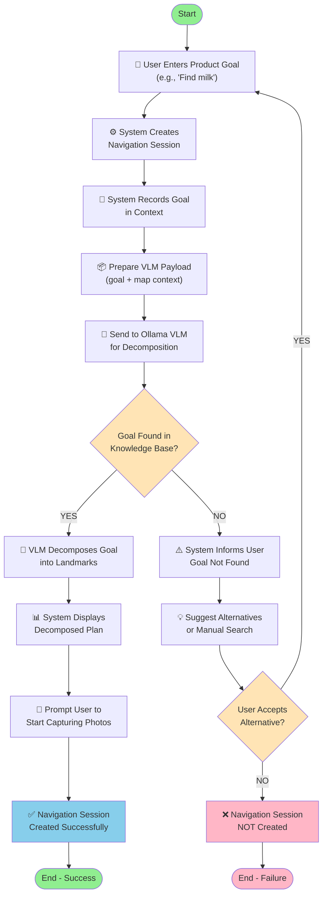
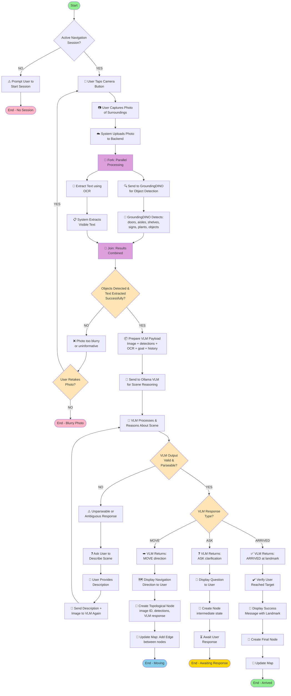
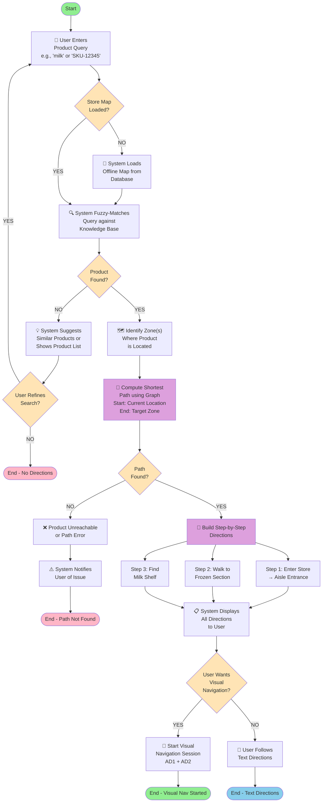

# Activity Diagrams — Vision Recognition & Diet Analysis Modules

This document provides detailed activity diagrams for the key use cases in both modules. These diagrams show the flow of activities, decision points, and system interactions.

---

## Table of Contents

1. [Vision Recognition Module](#vision-recognition-module)
   - [AD1: Start Navigation Session](#ad1-start-navigation-session)
   - [AD2: Capture & Upload Photo](#ad2-capture--upload-photo)
   - [AD3: Build Environment Map](#ad3-build-environment-map)
   - [AD4: Query Product Location](#ad4-query-product-location)

2. [Diet Analysis Module](#diet-analysis-module)
   - [AD5: Log Diet & Nutrition](#ad5-log-diet--nutrition)
   - [AD6: Scan Nutrition Label](#ad6-scan-nutrition-label)

3. [Legend](#legend)

---

## Vision Recognition Module

### AD1: Start Navigation Session

**Purpose**: User states a product goal; system decomposes it into navigation landmarks

**Swimlanes**: User, System, Ollama VLM Service

---

### AD2: Capture & Upload Photo

**Purpose**: User captures photo; system processes it and returns navigation instruction (MOVE/ASK/ARRIVED)

**Swimlanes**: User, System, GroundingDINO Service, Ollama VLM Service, Database

---

### AD3: Build Environment Map

**Purpose**: Offline batch process to build a topological map from survey photos

```mermaid
graph TD
    Start([Start]) --> OperatorInput["👤 Mapping Operator Provides<br/>Survey Photo Folder"]
    OperatorInput --> InitBatch["⚙️ System Initializes<br/>Batch Mapper"]
    InitBatch --> ReadPhotos["📂 System Reads List<br/>of Photos from Folder"]
    ReadPhotos --> LoopStart["🔄 Begin Loop:<br/>For Each Photo"]
    
    LoopStart --> SendDINO["📸 Send Photo to<br/>GroundingDINO"]
    SendDINO --> DetectObjects["🎯 GroundingDINO Detects<br/>Objects & Landmarks"]
    DetectObjects --> StoreDetections["💾 Store Detections<br/>in Memory"]
    
    StoreDetections --> LoopCheck{All Photos<br/>Processed?}
    LoopCheck -->|NO| LoopStart
    LoopCheck -->|YES| ClusterPhase["📊 Phase: Clustering"]
    
    ClusterPhase --> GroupZones["🗺️ System Groups Photos<br/>into Zones Based on<br/>Shared Objects"]
    GroupZones --> Zone1["🏪 Zone 1: Frozen Aisle<br/>shared 'Frozen Foods' sign"]
    GroupZones --> Zone2["🥬 Zone 2: Produce<br/>shared 'Produce' sign"]
    GroupZones --> Zone3["💳 Zone 3: Checkout<br/>shared 'Checkout' sign"]
    
    Zone1 --> ClusterCheck{Clustering<br/>Consistent?<br/>No Gaps/Noise?}
    Zone2 --> ClusterCheck
    Zone3 --> ClusterCheck
    
    ClusterCheck -->|NO| FlagPhotos["⚠️ Flag Photos<br/>with Issues"]
    FlagPhotos --> SuggestRetake["📸 Suggest Operator<br/>Retake Photos"]
    SuggestRetake --> PauseRun["⏸️ Pause Batch Run"]
    PauseRun --> OperatorReview["👤 Operator Reviews<br/>& Adds More Photos"]
    OperatorReview --> ReadPhotos
    
    ClusterCheck -->|YES| EdgePhase["🔗 Phase: Build Graph Edges"]
    
    EdgePhase --> EdgeLoop["🔄 For Each Zone Pair"]
    EdgeLoop --> CheckShared{Zones Share<br/>Objects?}
    
    CheckShared -->|YES| CreateEdge["🔀 Create Edge<br/>Zone A ↔ Zone B<br/>indicates adjacency"]
    CreateEdge --> EdgeContinue{More Zone<br/>Pairs?}
    
    CheckShared -->|NO| NoEdge["✗ No Connection"]
    NoEdge --> EdgeContinue
    
    EdgeContinue -->|YES| EdgeLoop
    EdgeContinue -->|NO| SaveJSON["💾 Save to JSON File<br/>detections, clusters,<br/>zones, edges"]
    
    SaveJSON --> RenderMap["🎨 Render Topological<br/>Map Image<br/>Nodes=Zones, Edges=Paths"]
    RenderMap --> SaveImage["💾 Save Map Image<br/>to Filesystem"]
    SaveImage --> OperatorReview2["👤 Operator Reviews<br/>Rendered Map"]
    
    OperatorReview2 --> MapAccept{Map<br/>Acceptable?}
    
    MapAccept -->|NO| ManualAnnotate["✏️ Operator Manually<br/>Annotates Zones<br/>e.g., 'Produce', 'Meat'"]
    ManualAnnotate --> UpdateMap["🔄 System Updates Map"]
    UpdateMap --> SaveFinal["💾 Save Finalized<br/>Version"]
    SaveFinal --> EndSuccess([End - Map Complete])
    
    MapAccept -->|YES| SaveFinal
    
    style Start fill:#90EE90
    style EndSuccess fill:#90EE90
    style LoopStart fill:#FFD700
    style ClusterPhase fill:#87CEEB
    style EdgePhase fill:#87CEEB
    style EdgeLoop fill:#FFD700
    style LoopCheck fill:#FFE4B5
    style ClusterCheck fill:#FFE4B5
    style CheckShared fill:#FFE4B5
    style MapAccept fill:#FFE4B5
    style EdgeContinue fill:#FFE4B5
```

**Swimlanes**: Mapping Operator, System, GroundingDINO Service, File Storage, Database

---

### AD4: Query Product Location

**Purpose**: User searches for product; system returns directions on pre-built map

**Swimlanes**: User, System, Database, Knowledge Base

---

## Diet Analysis Module

### AD5: Log Diet & Nutrition

**Purpose**: Main use case for recording food intake (can use scanning OR manual entry)

```mermaid
graph TD
    Start([Start]) --> OpenTab["👤 User Opens<br/>Diet Analysis Tab"]
    OpenTab --> DisplayInterface["📊 System Displays<br/>Diet Logging Interface"]
    DisplayInterface --> DecisionInput{How to<br/>Enter<br/>Data?}
    
    DecisionInput -->|SCAN| ScanPath["📸 Proceed to AD6<br/>Scan Nutrition Label"]
    ScanPath --> SkipManual[ ]
    
    DecisionInput -->|MANUAL| ManualForm["📋 System Displays<br/>Manual Entry Form"]
    ManualForm --> EnterFood["👤 User Enters<br/>Food Name<br/>e.g., 'Apple'"]
    EnterFood --> EnterNutrition["👤 User Enters<br/>Nutrition Values<br/>Calories, Carbs,<br/>Protein, Fat"]
    EnterNutrition --> SubmitForm["✅ User Submits Form"]
    
    SubmitForm --> DecisionValid{Input<br/>Valid?<br/>Non-empty name,<br/>positive values?}
    
    DecisionValid -->|NO| ShowError["❌ System Shows<br/>Error Message"]
    ShowError --> DecisionRetry{User<br/>Corrects<br/>Input?}
    
    DecisionRetry -->|YES| EnterFood
    DecisionRetry -->|NO| EndNoSave([End - No Save])
    
    DecisionValid -->|YES| SavePhase["💾 Phase: Save Record"]
    SavePhase --> CreateRecord["📝 System Creates Record<br/>Food name + Nutrition<br/>values + Timestamp<br/>+ User ID"]
    CreateRecord --> StoreDB["💾 Store Record in<br/>Local Database"]
    
    SkipManual --> SummarizePhase["📊 Phase: Summarize<br/>Daily Calories"]
    StoreDB --> SummarizePhase
    
    SummarizePhase --> QueryRecords["🔍 System Queries All<br/>Records for<br/>Current Date"]
    QueryRecords --> CalcTotals["🧮 Calculate Daily Totals<br/>Calories: 2150 kcal<br/>Carbs: 285g<br/>Protein: 95g<br/>Fat: 72g"]
    
    CalcTotals --> DecisionGoal{Daily Goal<br/>Exists?}
    
    DecisionGoal -->|NO| NoGoal["📋 Display Totals<br/>without Goals"]
    NoGoal --> UpdateDisplay
    
    DecisionGoal -->|YES| CalcGoal["📊 Calculate Goal<br/>Progress<br/>Goal: 2000 kcal<br/>Consumed: 2150 kcal<br/>107.5% → EXCEEDED"]
    CalcGoal --> DecisionExceeded{Goal<br/>Exceeded?}
    
    DecisionExceeded -->|YES| SendNotif["🔔 Send Notification<br/>to User"]
    SendNotif --> UpdateDisplay["🎨 System Updates<br/>Diet Summary Display<br/>Today's totals + macros<br/>+ Goal progress<br/>+ Recent entries"]
    
    DecisionExceeded -->|NO| UpdateDisplay
    
    UpdateDisplay --> ShowSummary["📊 User Sees Updated<br/>Diet Summary"]
    ShowSummary --> EndSuccess([End - Saved])
    
    style Start fill:#90EE90
    style EndSuccess fill:#90EE90
    style EndNoSave fill:#FFB6C6
    style DecisionInput fill:#FFE4B5
    style DecisionValid fill:#FFE4B5
    style DecisionRetry fill:#FFE4B5
    style DecisionGoal fill:#FFE4B5
    style DecisionExceeded fill:#FFE4B5
    style SavePhase fill:#87CEEB
    style SummarizePhase fill:#87CEEB
```

**Swimlanes**: User, System, Database

---

### AD6: Scan Nutrition Label

**Purpose**: User photographs nutrition label; OCR extracts values and saves record

```mermaid
graph TD
    Start([Start]) --> OpenTab["👤 User Opens<br/>Diet Analysis Tab"]
    OpenTab --> SelectScan["👤 User Selects<br/>'Scan Nutrition Label'"]
    SelectScan --> OpenCamera["📸 System Opens<br/>Camera Interface"]
    OpenCamera --> AlignCamera["👤 User Aligns Camera<br/>with Nutrition Label"]
    AlignCamera --> CapturePhoto["📷 User Captures<br/>Photo"]
    CapturePhoto --> SendOCR["☁️ System Sends Image<br/>to PaddleOCR Service"]
    
    SendOCR --> OCRProcess["🤖 PaddleOCR Processes<br/>Image & Recognizes<br/>Text"]
    OCRProcess --> DecisionText{Text<br/>Successfully<br/>Extracted?}
    
    DecisionText -->|NO| Unclear["❌ Label Unreadable<br/>or Unclear"]
    Unclear --> RetakePrompt["📸 System Asks User<br/>to Retake<br/>Better lighting/angle"]
    RetakePrompt --> DecisionRetake{User<br/>Retakes?}
    
    DecisionRetake -->|YES| OpenCamera
    DecisionRetake -->|NO| EndNoExtract([End - Not Extracted])
    
    DecisionText -->|YES| ParseOCR["📝 System Parses<br/>OCR Output"]
    ParseOCR --> ExtractValues["📋 System Extracts<br/>Nutrition Values<br/>Calories: 150 kcal<br/>Carbs: 20g<br/>Protein: 8g<br/>Fat: 3g"]
    
    ExtractValues --> DecisionComplete{All Key<br/>Values<br/>Found?}
    
    DecisionComplete -->|NO| MissingValues["⚠️ Missing Calories<br/>or Serving Size"]
    MissingValues --> AskManual["❓ System Asks User<br/>to Enter Manually"]
    AskManual --> ManualInput["👤 User Enters<br/>Missing Values"]
    ManualInput --> CreateRecord
    
    DecisionComplete -->|YES| CreateRecord["📝 System Creates<br/>Diet Record<br/>Food name + values<br/>+ Timestamp<br/>+ Source: Scanned"]
    CreateRecord --> StoreDB["💾 Store Record<br/>in Database"]
    
    StoreDB --> SummarizePhase["📊 Phase: Summarize<br/>Daily Calories"]
    SummarizePhase --> QueryRecords["🔍 Query All Records<br/>for Today"]
    QueryRecords --> CalcTotals["🧮 Recalculate Totals<br/>and Update Display"]
    
    CalcTotals --> Confirmation["✅ User Sees<br/>Confirmation<br/>Food Logged Successfully"]
    Confirmation --> DecisionAgain{Scan<br/>Another?}
    
    DecisionAgain -->|YES| OpenCamera
    DecisionAgain -->|NO| EndSuccess([End - Scan Complete])
    
    style Start fill:#90EE90
    style EndSuccess fill:#90EE90
    style EndNoExtract fill:#FFB6C6
    style DecisionText fill:#FFE4B5
    style DecisionRetake fill:#FFE4B5
    style DecisionComplete fill:#FFE4B5
    style DecisionAgain fill:#FFE4B5
    style SummarizePhase fill:#87CEEB
    style OCRProcess fill:#DDA0DD
    style SendOCR fill:#DDA0DD
```

**Swimlanes**: User, System, PaddleOCR Service, Database

---

## Legend

### Activity Diagram Symbols

| Symbol | Meaning |
|--------|---------|
| ● (Filled circle) | Start activity |
| ○ (Empty circle) | End activity |
| Rectangle | Activity/Action (process step) |
| Diamond | Decision point (YES/NO branch) |
| Arrow → | Flow of control |
| ∥ | Parallel processing (fork/join bar) |
| Rectangle with lines | Swimlane (actor/component) |
| ┌─┐ | Subactivity/Phase group |

### Key Concepts

- **Decision Points**: Branches flow based on conditions (YES/NO)
- **Parallel Processing**: Multiple activities can occur simultaneously (marked with ∥)
- **Swimlanes**: Show which actor/component performs each activity
- **Loops**: Activities can repeat based on conditions
- **Subactivities**: Complex activities can be broken into phases

---

## How to Use These Diagrams

1. **In Visual Paradigm**:
   - Create a new Activity Diagram
   - Add swimlanes for each actor (User, System, Services)
   - Add activities and decision points following the flow above
   - Connect with arrows

2. **In Lucidchart**:
   - Use the activity diagram shapes
   - Organize by swimlanes
   - Add decision branches with diamond shapes

3. **In Draw.io / Miro**:
   - Create swimlane containers
   - Add activity shapes (rectangles) and decision shapes (diamonds)
   - Connect with arrows

4. **In Figma** (with plugins):
   - Use diagram components
   - Follow the flow structure above

---

## Notes

- These activity diagrams represent the **happy paths** and **common exception flows**
- Each diagram can be expanded with more detail as needed
- Decision outcomes are marked with brackets: `[Decision: ...]`
- Parallel activities are shown in boxes with vertical lines: `├─`, `└─`
- For implementation, focus on swimlanes to understand responsibility distribution

---

**Document Version**: 1.0  
**Last Updated**: 2026-06-12  
**For**: OOSD Assignment - Vision Recognition & Diet Analysis Module
