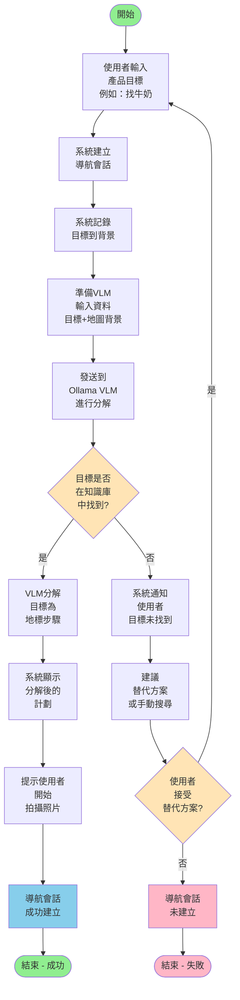
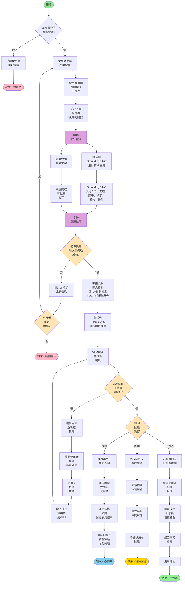
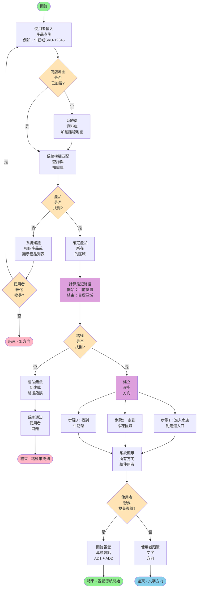

# 活動圖表 — 視覺語意辨識與飲食分析模組

本文件提供兩個模組主要使用案例的詳細活動圖表。這些圖表顯示活動流程、決策點和系統互動。

---

## 目錄

1. [視覺語意辨識模組](#視覺語意辨識模組)
   - [AD1：開始導航會話](#ad1開始導航會話)
   - [AD2：擷取並上傳照片](#ad2擷取並上傳照片)
   - [AD3：建構環境地圖](#ad3建構環境地圖)
   - [AD4：查詢產品位置](#ad4查詢產品位置)

2. [飲食分析模組](#飲食分析模組)
   - [AD5：記錄飲食與營養](#ad5記錄飲食與營養)
   - [AD6：掃描營養標籤](#ad6掃描營養標籤)

3. [圖例](#圖例)

---

## 視覺語意辨識模組

### AD1: 開始導航會話

**Purpose**: 使用者陳述產品目標；系統將其分解為導航地標

**Swimlanes**: User, System, Ollama VLM Service

---

### AD2: 擷取並上傳照片

**Purpose**: 使用者拍攝照片；系統處理並返回導航指令（移動/詢問/已到達）

**Swimlanes**: User, System, GroundingDINO Service, Ollama VLM Service, Database

---

### AD3: 建構環境地圖

**Purpose**: 離線批次處理，從調查照片建構拓樸地圖

```mermaid
graph TD
    Start([開始]) --> OperatorInput["地圖操作員<br/>提供調查<br/>照片資料夾"]
    OperatorInput --> InitBatch["系統初始化<br/>批次映射器"]
    InitBatch --> ReadPhotos["系統讀取<br/>照片列表<br/>從資料夾"]
    ReadPhotos --> LoopStart["開始迴圈：<br/>每張照片"]
    
    LoopStart --> SendDINO["發送照片<br/>到<br/>GroundingDINO"]
    SendDINO --> DetectObjects["GroundingDINO<br/>偵測物件<br/>和地標"]
    DetectObjects --> StoreDetections["在記憶體<br/>中儲存<br/>偵測結果"]
    
    StoreDetections --> LoopCheck{所有照片<br/>都已<br/>處理?}
    LoopCheck -->|否| LoopStart
    LoopCheck -->|是| ClusterPhase["階段：聚類"]
    
    ClusterPhase --> GroupZones["系統根據<br/>共享物件<br/>將照片分組為區域"]
    GroupZones --> Zone1["區域1：冷凍走道<br/>共享『冷凍食品』標示"]
    GroupZones --> Zone2["區域2：農產品<br/>共享『農產品』標示"]
    GroupZones --> Zone3["區域3：結帳<br/>共享『結帳』標示"]
    
    Zone1 --> ClusterCheck{聚類<br/>一致?<br/>無間隙/雜訊?}
    Zone2 --> ClusterCheck
    Zone3 --> ClusterCheck
    
    ClusterCheck -->|否| FlagPhotos["標記有<br/>問題的<br/>照片"]
    FlagPhotos --> SuggestRetake["建議操作員<br/>重新<br/>拍攝"]
    SuggestRetake --> PauseRun["暫停<br/>批次<br/>運行"]
    PauseRun --> OperatorReview["操作員<br/>檢視並<br/>新增照片"]
    OperatorReview --> ReadPhotos
    
    ClusterCheck -->|是| EdgePhase["階段：建立圖邊"]
    
    EdgePhase --> EdgeLoop["迴圈：<br/>每對區域"]
    EdgeLoop --> CheckShared{區域<br/>共享<br/>物件?}
    
    CheckShared -->|是| CreateEdge["建立邊<br/>區域A ↔ 區域B<br/>表示相鄰"]
    CreateEdge --> EdgeContinue{還有<br/>更多<br/>區域對?}
    
    CheckShared -->|否| NoEdge["無連接"]
    NoEdge --> EdgeContinue
    
    EdgeContinue -->|是| EdgeLoop
    EdgeContinue -->|否| SaveJSON["保存到<br/>JSON檔案<br/>偵測、聚類、邊"]
    
    SaveJSON --> RenderMap["渲染拓樸<br/>地圖影像<br/>節點=區域"]
    RenderMap --> SaveImage["保存地圖<br/>影像到<br/>檔案系統"]
    SaveImage --> OperatorReview2["操作員<br/>檢視<br/>渲染地圖"]
    
    OperatorReview2 --> MapAccept{地圖<br/>可接受?}
    
    MapAccept -->|否| ManualAnnotate["操作員<br/>手動標注<br/>區域名稱"]
    ManualAnnotate --> UpdateMap["系統<br/>更新<br/>地圖"]
    UpdateMap --> SaveFinal["保存最終<br/>版本"]
    SaveFinal --> EndSuccess([結束 - 地圖完成])
    
    MapAccept -->|是| SaveFinal
    
    style Start fill:#90EE90
    style EndSuccess fill:#90EE90
    style LoopStart fill:#FFD700
    style ClusterPhase fill:#87CEEB
    style EdgePhase fill:#87CEEB
    style EdgeLoop fill:#FFD700
    style LoopCheck fill:#FFE4B5
    style ClusterCheck fill:#FFE4B5
    style CheckShared fill:#FFE4B5
    style MapAccept fill:#FFE4B5
    style EdgeContinue fill:#FFE4B5
```

**Swimlanes**: Mapping Operator, System, GroundingDINO Service, File Storage, Database

---

### AD4: 查詢產品位置

**Purpose**: 使用者搜尋產品；系統在預建地圖上返回方向

**Swimlanes**: User, System, Database, Knowledge Base

---

## 飲食分析模組

### AD5: 記錄飲食與營養

**Purpose**: 記錄食物攝取的主要使用案例（可使用掃描或手動輸入）

```mermaid
graph TD
    Start([開始]) --> OpenTab["使用者打開<br/>飲食分析<br/>頁籤"]
    OpenTab --> DisplayInterface["系統顯示<br/>飲食記錄<br/>介面"]
    DisplayInterface --> DecisionInput{如何<br/>輸入<br/>資料?}
    
    DecisionInput -->|掃描| ScanPath["進行到AD6<br/>掃描營養<br/>標籤"]
    ScanPath --> SkipManual[ ]
    
    DecisionInput -->|手動| ManualForm["系統顯示<br/>手動輸入<br/>表單"]
    ManualForm --> EnterFood["使用者輸入<br/>食物名稱<br/>例如：蘋果"]
    EnterFood --> EnterNutrition["使用者輸入<br/>營養值<br/>卡路里、碳水、<br/>蛋白質、脂肪"]
    EnterNutrition --> SubmitForm["使用者<br/>提交<br/>表單"]
    
    SubmitForm --> DecisionValid{輸入<br/>有效?<br/>非空名稱、<br/>正數值?}
    
    DecisionValid -->|否| ShowError["系統顯示<br/>錯誤<br/>訊息"]
    ShowError --> DecisionRetry{使用者<br/>修正<br/>輸入?}
    
    DecisionRetry -->|是| EnterFood
    DecisionRetry -->|否| EndNoSave([結束 - 未保存])
    
    DecisionValid -->|是| SavePhase["階段：保存記錄"]
    SavePhase --> CreateRecord["系統建立記錄<br/>食物名稱+營養值<br/>+時間戳記<br/>+使用者ID"]
    CreateRecord --> StoreDB["將記錄存儲<br/>到本地<br/>資料庫"]
    
    SkipManual --> SummarizePhase["階段：<br/>總結每日<br/>卡路里"]
    StoreDB --> SummarizePhase
    
    SummarizePhase --> QueryRecords["系統查詢<br/>目前日期<br/>的所有記錄"]
    QueryRecords --> CalcTotals["計算每日總計<br/>卡路里：2150卡<br/>碳水：285克<br/>蛋白質：95克<br/>脂肪：72克"]
    
    CalcTotals --> DecisionGoal{每日<br/>目標<br/>是否<br/>存在?}
    
    DecisionGoal -->|否| NoGoal["顯示總計<br/>不含<br/>目標"]
    NoGoal --> UpdateDisplay
    
    DecisionGoal -->|是| CalcGoal["計算目標<br/>進度<br/>目標：2000卡<br/>已消耗：2150卡<br/>107.5% 超出"]
    CalcGoal --> DecisionExceeded{目標<br/>是否<br/>超出?}
    
    DecisionExceeded -->|是| SendNotif["發送通知<br/>給使用者"]
    SendNotif --> UpdateDisplay["系統更新<br/>飲食摘要顯示<br/>今日總計、巨量<br/>營養素、進度、<br/>最近的項目"]
    
    DecisionExceeded -->|否| UpdateDisplay
    
    UpdateDisplay --> ShowSummary["使用者看到<br/>更新的<br/>飲食摘要"]
    ShowSummary --> EndSuccess([結束 - 已保存])
    
    style Start fill:#90EE90
    style EndSuccess fill:#90EE90
    style EndNoSave fill:#FFB6C6
    style DecisionInput fill:#FFE4B5
    style DecisionValid fill:#FFE4B5
    style DecisionRetry fill:#FFE4B5
    style DecisionGoal fill:#FFE4B5
    style DecisionExceeded fill:#FFE4B5
    style SavePhase fill:#87CEEB
    style SummarizePhase fill:#87CEEB
```

**Swimlanes**: User, System, Database

---

### AD6: 掃描營養標籤

**Purpose**: 使用者拍攝營養標籤；OCR提取數值並保存記錄

```mermaid
graph TD
    Start([開始]) --> OpenTab["使用者打開<br/>飲食分析<br/>頁籤"]
    OpenTab --> SelectScan["使用者選擇<br/>『掃描營養<br/>標籤』"]
    SelectScan --> OpenCamera["系統打開<br/>相機<br/>介面"]
    OpenCamera --> AlignCamera["使用者將相機<br/>對齊<br/>營養標籤"]
    AlignCamera --> CapturePhoto["使用者拍攝<br/>照片"]
    CapturePhoto --> SendOCR["系統發送<br/>影像到<br/>PaddleOCR服務"]
    
    SendOCR --> OCRProcess["PaddleOCR<br/>處理影像<br/>並識別文字"]
    OCRProcess --> DecisionText{文字是否<br/>成功<br/>提取?}
    
    DecisionText -->|否| Unclear["標籤無法<br/>讀取或<br/>不清楚"]
    Unclear --> RetakePrompt["系統要求<br/>使用者<br/>重新拍攝"]
    RetakePrompt --> DecisionRetake{使用者<br/>重新<br/>拍攝?}
    
    DecisionRetake -->|是| OpenCamera
    DecisionRetake -->|否| EndNoExtract([結束 - 未提取])
    
    DecisionText -->|是| ParseOCR["系統解析<br/>OCR<br/>輸出"]
    ParseOCR --> ExtractValues["系統提取<br/>營養值<br/>卡路里：150卡<br/>碳水：20克<br/>蛋白質：8克<br/>脂肪：3克"]
    
    ExtractValues --> DecisionComplete{是否找到<br/>所有<br/>關鍵<br/>值?}
    
    DecisionComplete -->|否| MissingValues["缺少卡路里<br/>或份量<br/>大小"]
    MissingValues --> AskManual["系統要求<br/>使用者<br/>手動輸入"]
    AskManual --> ManualInput["使用者輸入<br/>缺少的<br/>數值"]
    ManualInput --> CreateRecord
    
    DecisionComplete -->|是| CreateRecord["系統建立<br/>飲食記錄<br/>食物名稱+值<br/>+時間戳記<br/>+來源：掃描"]
    CreateRecord --> StoreDB["將記錄<br/>存儲到<br/>資料庫"]
    
    StoreDB --> SummarizePhase["階段：<br/>總結每日<br/>卡路里"]
    SummarizePhase --> QueryRecords["查詢今天<br/>的所有<br/>記錄"]
    QueryRecords --> CalcTotals["重新計算<br/>總計並<br/>更新顯示"]
    
    CalcTotals --> Confirmation["使用者看到<br/>確認訊息<br/>食物記錄成功"]
    Confirmation --> DecisionAgain{掃描<br/>另一項?}
    
    DecisionAgain -->|是| OpenCamera
    DecisionAgain -->|否| EndSuccess([結束 - 掃描完成])
    
    style Start fill:#90EE90
    style EndSuccess fill:#90EE90
    style EndNoExtract fill:#FFB6C6
    style DecisionText fill:#FFE4B5
    style DecisionRetake fill:#FFE4B5
    style DecisionComplete fill:#FFE4B5
    style DecisionAgain fill:#FFE4B5
    style SummarizePhase fill:#87CEEB
    style OCRProcess fill:#DDA0DD
    style SendOCR fill:#DDA0DD
```

**Swimlanes**: User, System, PaddleOCR Service, Database

---

## 圖例

### 活動圖表符號

| 符號 | 含義 |
|--------|---------|
| ● (實心圓) | 開始活動 |
| ○ (空心圓) | 結束活動 |
| 矩形 | 活動/動作（流程步驟） |
| 菱形 | 決策點（是/否分支） |
| 箭頭 → | 控制流 |
| ∥ | 平行處理（開始/結束點） |
| 有邊框的矩形 | 泳道（參與者/元件） |
| ┌─┐ | 子活動/階段組 |

### 關鍵概念

- **決策點**：根據條件分支流程（是/否）
- **平行處理**：多項活動可同時進行（用∥標記）
- **泳道**：顯示哪位參與者/元件執行各活動
- **迴圈**：活動可根據條件重複
- **子活動**：複雜活動可分解為多個階段

---

## 如何使用這些圖表

1. **在Visual Paradigm中**：
   - 建立新的活動圖表
   - 為每位參與者新增泳道（使用者、系統、服務）
   - 按照上述流程新增活動和決策點
   - 用箭頭連接

2. **在Lucidchart中**：
   - 使用活動圖表形狀
   - 按泳道組織
   - 用菱形新增決策分支

3. **在Draw.io / Miro中**：
   - 建立泳道容器
   - 新增活動形狀（矩形）和決策形狀（菱形）
   - 用箭頭連接

4. **在Figma中**（帶外掛）：
   - 使用圖表元件
   - 按照上述流程結構

---

## 注意事項

- 這些活動圖表代表**正常路徑**和**常見例外流程**
- 每個圖表可根據需要擴展以增加更多細節
- 決策結果用括號標記：`[決策：...]`
- 平行活動在框中用豎線顯示：`├─`、`└─`
- 實現時，重點關注泳道以理解責任分配

---

**文件版本**：1.0  
**最後更新**：2026-06-12  
**用途**：OOSD作業 - 視覺語意辨識與飲食分析模組
